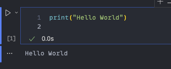

# conda 用の環境構築

## git clone

```
cd <環境構築したいディレクトリ>
```

```bash
git clone https://github.com/University-Laboratory/rnn-pann.git
cd rnn-pann
```

## conda 環境作成

```bash
conda create -n <環境名> python=3.12 -y
conda activate <環境名>
```

例

```bash
conda create -n rnn-pann python=3.12 -y
conda activate rnn-pann
```

## pip 最新

```bash
python -m pip install -U pip
```

## pyproject.toml

```bash
pip install -e .
```

# 実行

## カーネルの変更


実行したいファイルの右上のカーネルの選択から先ほど作成した環境名を選択

もしくは、ctrl + shift + p で "Python: Select Interpreter" を選択して、先ほど作成した環境名を選択

## 実行

実行したいファイルの上部の実行ボタンをクリック

もしくは、セルの右側の実行ボタンをクリック



## .py ファイルとして実行したい場合

```bash
jupyter nbconvert --to script <your_notebook>.ipynb
```

例

```bash
jupyter nbconvert --to script actual_machine_notebooks/note1/note1.ipynb
```

これにより、<your_notebook>.py ファイルが生成される

実行するファイルによっては、実行時にエラーが発生する場合があるので、適宜修正してください

特に、src/utils/load_data.py のパスを修正する必要がある場合があります...
