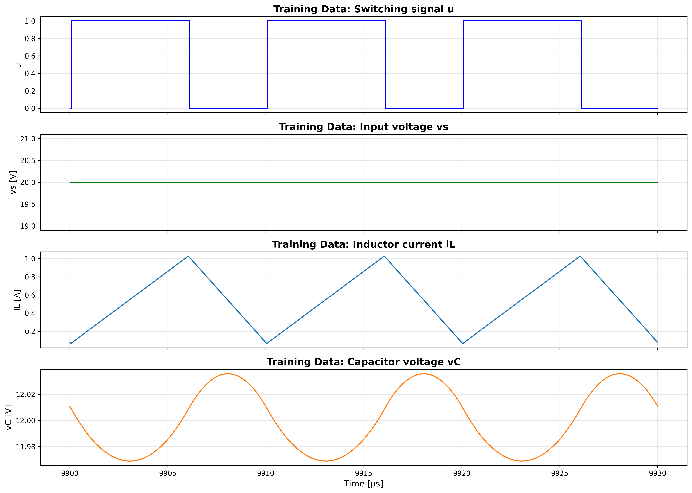
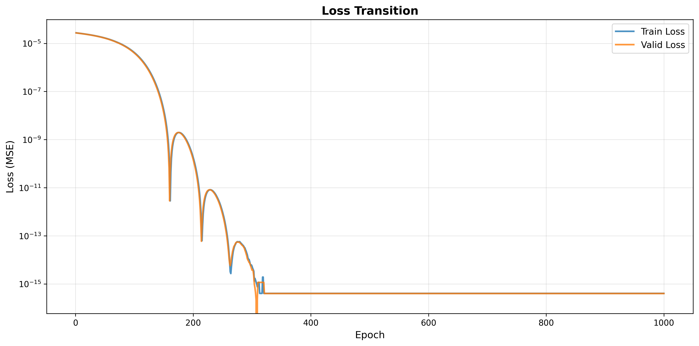
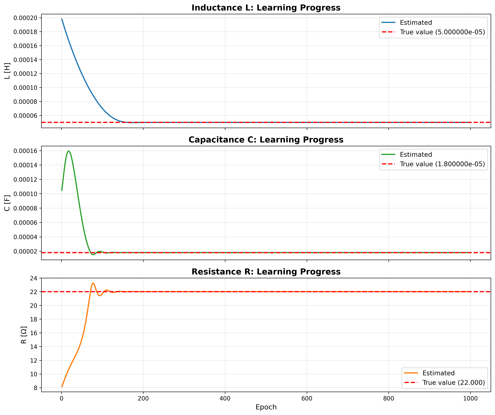
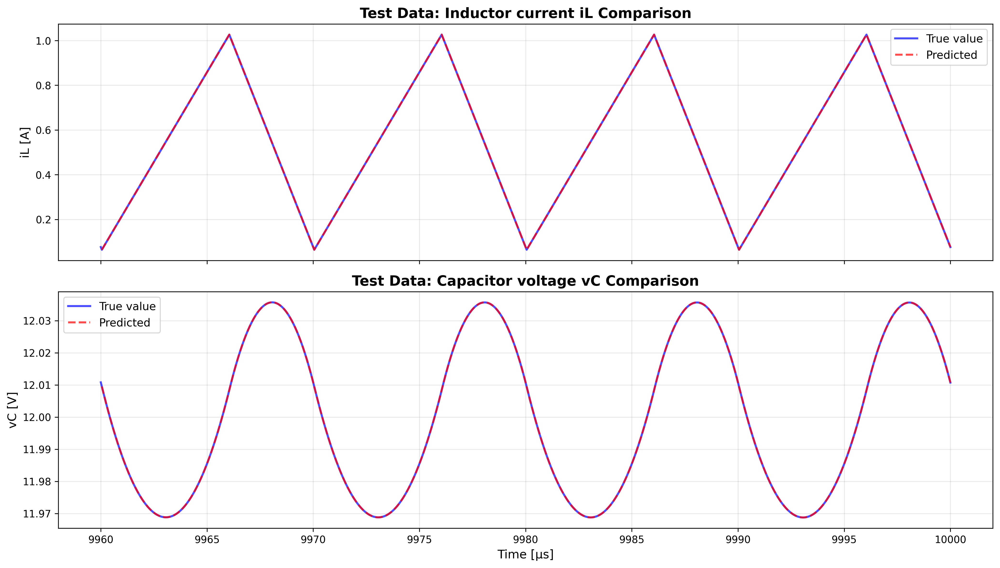

# notebooks/note17.ipynb 実行ログ

実行日時: 2025-12-03 16:25:38

---

## 最終結果

```
============================================================

【回路パラメータ】
  真の値: L = 5.000000e-05 [H], C = 1.800000e-05 [F], R = 22.000 [Ω]
  初期値: L = 2.000000e-04 [H], C = 1.000000e-04 [F], R = 8.000 [Ω]
  推論値: L = 5.000011e-05 [H], C = 1.800001e-05 [F], R = 22.000 [Ω]

【入力条件】
  Vin (入力電圧) = 20.00 [V], Vref (目標電圧) = 12.00 [V]
  スイッチング周波数 f_sw = 100000 [Hz]
  1周期あたりのプロット数 = 200

【学習設定】
  エポック数 = 1000
  学習率: L = 1.00e-02, C = 5.00e-02, R = 2.00e-02

【データ分割】
  学習データ: 600 ステップ
  検証データ: 600 ステップ
  テストデータ: 801 ステップ

【最終Loss】
  学習データ: 4.034736e-16
  検証データ: 3.986163e-16
  テストデータ: 4.100886e-16

【学習設定】
  エポック数: 1000
  学習率: L = 1.00e-02, C = 5.00e-02, R = 2.00e-02
```

## 学習データ



## Lossの遷移



## 回路パラメータの学習による変化



## テストデータでの予測結果



