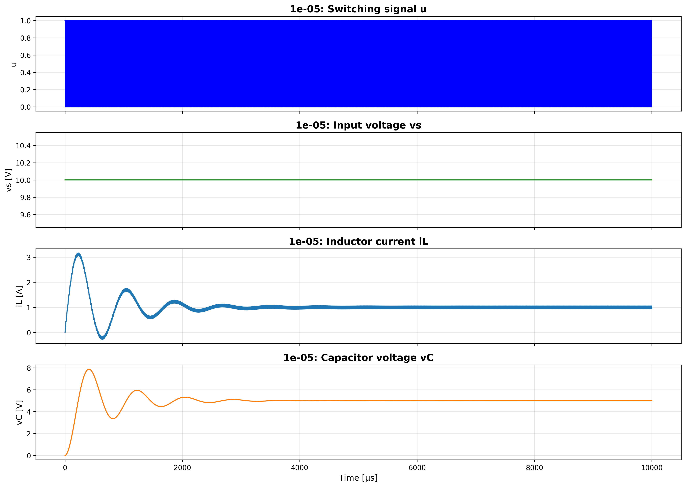
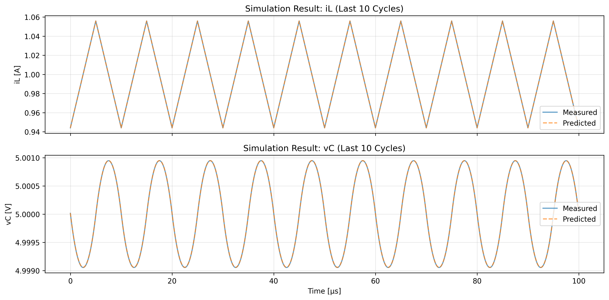
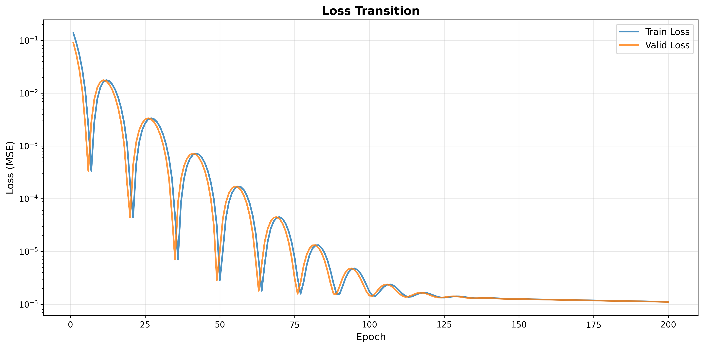
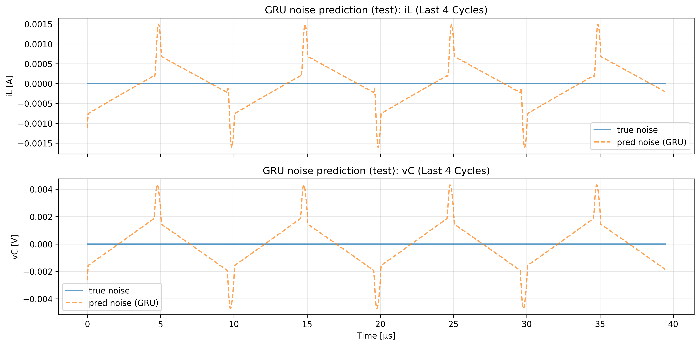
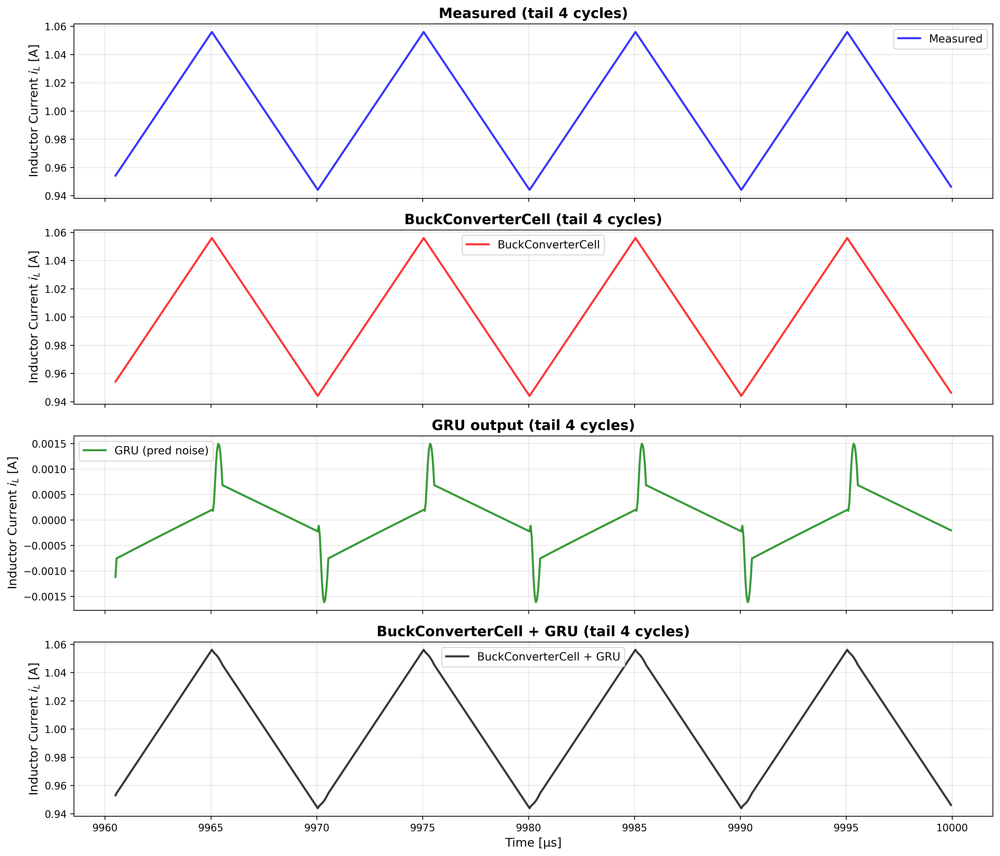
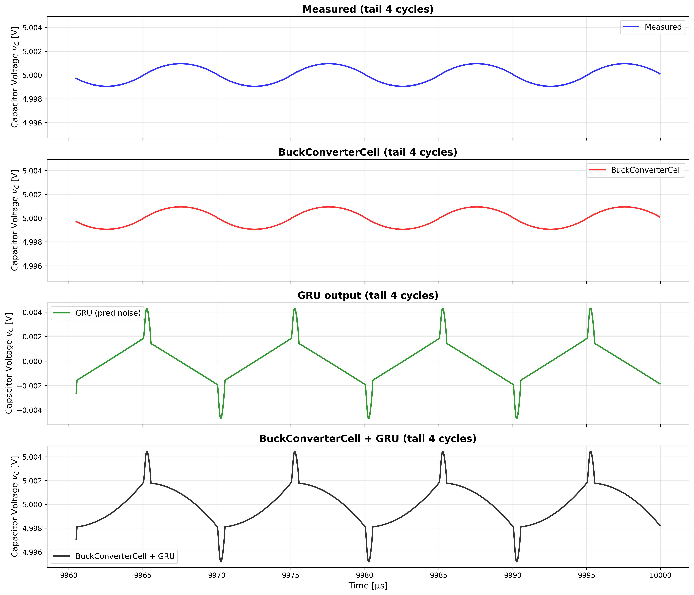

# actual_machine_notebooks/note3/note_sim.ipynb 実行ログ

実行日時: 2025-12-20 16:32:51

---

## Lossの遷移

## 回路パラメータの学習による変化

## シミュレーション結果(0から1000周期までシミュレーションし、定常箇所と実機のデータの比較)

## GRU 学習データ

## GRU Lossの遷移

## GRU noise予測(テスト, tail10T)

## iL: Measured / Buck / GRU / Buck+GRU（末尾4周期）

## vC: Measured / Buck / GRU / Buck+GRU（末尾4周期）

