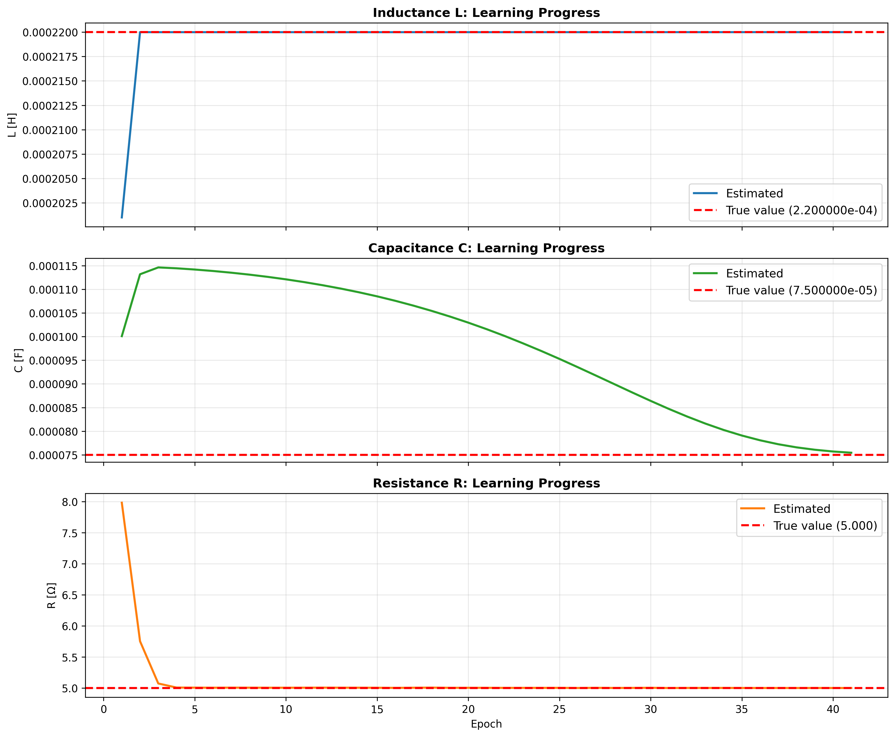
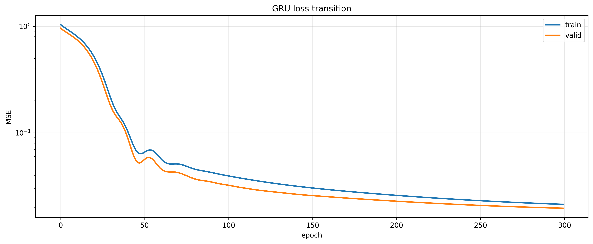
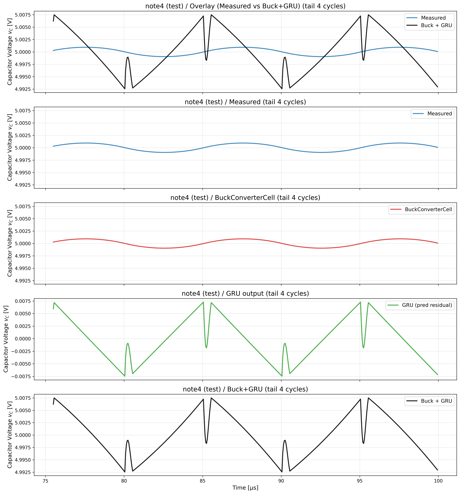

# actual_machine_notebooks/note4/note_sim.ipynb 実行ログ

実行日時: 2025-12-22 14:22:10

---

## Params

```
C_init: 0.0001
C_true: 7.5e-05
L_init: 0.0002
L_true: 0.00022
R_init: 8.0
R_true: 5.0
T: 1e-05
Vin: 10.0
Vref: 5.0
batch_size: 256
cycles: 1200
duty: 0.5
epochs_buck: 8000
epochs_gru: 300
f_sw: 100000.0
grad_clip_norm: 5.0
gru_lr: 0.001
lr_c: 0.001
lr_l: 0.005
lr_r: 0.002
noise_std_iL: 0.02
noise_std_vC: 0.02
samples_per_cycle: 200
seq_length: 10
train_cycles: 10
train_ratio: 0.5
valid_ratio: 0.25
win_len: 50
```

## 擬似計測波形


## 学習データ（末尾10周期）


## Buck 推定値

```
L_hat=2.200003e-04
C_hat=7.543847e-05
R_hat=5.000073e+00

```

## Buck 損失遷移


## Buck パラメータ推定の推移



## Buck rollout比較(train)


## Buck rollout比較(valid)


## Buck rollout比較(test)


## GRU 学習データ（特徴量・全体）


## GRU 損失遷移



## GRU 評価

```
GRU test loss=3.685277e-07

```

## iL: Measured / Buck / GRU / Buck+GRU（末尾4周期）


## vC: Measured / Buck / GRU / Buck+GRU（末尾4周期）



## Buck+GRU 評価(test)

```
MSE buck=8.811593e-12
MSE buck+gru=8.608980e-06

```

