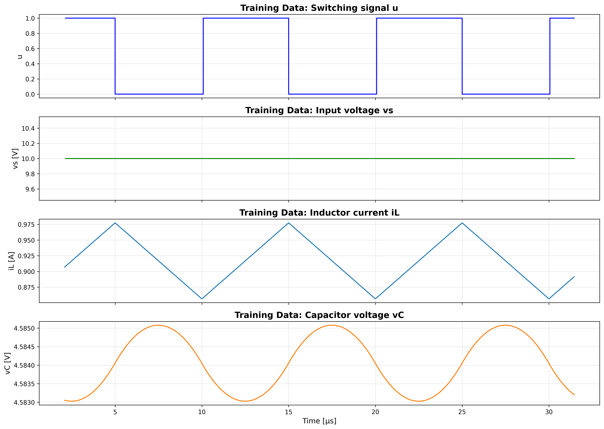
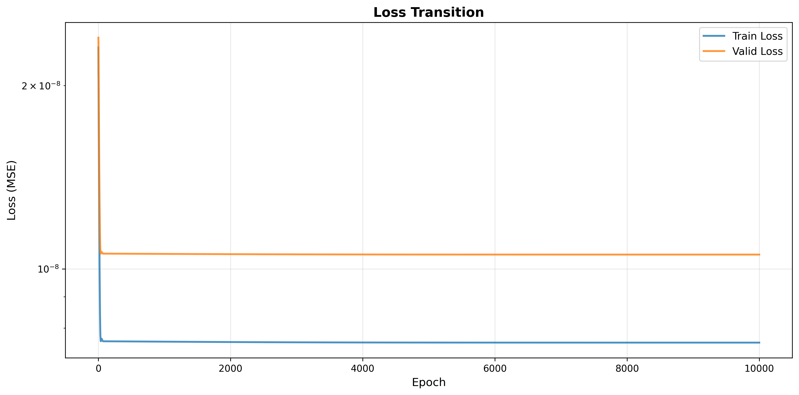
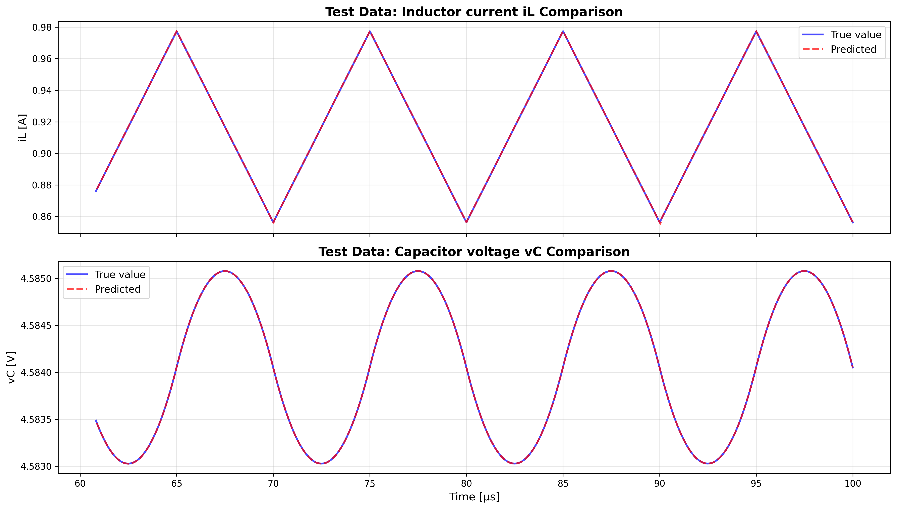
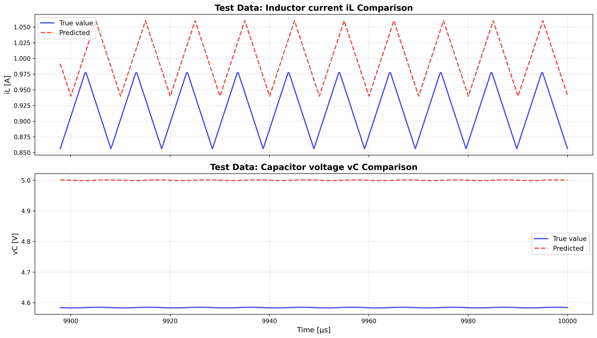

# notebooks/note17.ipynb 実行ログ

実行日時: 2026-01-13 16:06:09

---

## 最終結果

```
============================================================

【回路パラメータ】
  真の値: L = 2.236000e-04 [H], C = 7.380000e-05 [F], R = 5.000 [Ω]
  初期値: L = 2.000000e-04 [H], C = 1.000000e-04 [F], R = 8.000 [Ω]
  推論値: L = 2.246548e-04 [H], C = 7.459963e-05 [F], R = 5.000 [Ω]

【入力条件】
  Vin (入力電圧) = 10.00 [V], Vref (目標電圧) = 5.00 [V]
  スイッチング周波数 f_sw = 100000 [Hz]
  1周期あたりのプロット数 = 200

【データ分割】
  シミュレーション時間: 1000周期 = 10000.0μs
  後ろから約10周期(2000ステップ, =100.0μs)を使用
  学習データ: 599 ステップ
  検証データ: 600 ステップ
  テストデータ: 801 ステップ

【最終Loss】
  学習データ: 4.328184e-09
  検証データ: 7.678985e-09
  テストデータ: 5.792392e-09

【学習設定】
  エポック数: 10000
  学習率: L = 5.00e-02, C = 1.00e-02, R = 2.00e-02
```

## 学習データ



## Lossの遷移



## 回路パラメータの学習による変化


## テストデータでの予測結果



## シミュレーション結果




---

実行日時: 2026-01-13 16:13:42

## 最終結果

```
============================================================

【回路パラメータ】
  真の値: L = 2.236000e-04 [H], C = 7.380000e-05 [F], R = 5.000 [Ω]
  初期値: L = 2.000000e-04 [H], C = 1.000000e-04 [F], R = 8.000 [Ω]
  推論値: L = 2.079467e-04 [H], C = 7.423393e-05 [F], R = 5.000 [Ω]

【入力条件】
  Vin (入力電圧) = 10.00 [V], Vref (目標電圧) = 5.00 [V]
  スイッチング周波数 f_sw = 100000 [Hz]
  1周期あたりのプロット数 = 200

【データ分割】
  シミュレーション時間: 1000周期 = 10000.0μs
  後ろから約10周期(2000ステップ, =97.9μs)を使用
  学習データ: 600 ステップ
  検証データ: 600 ステップ
  テストデータ: 801 ステップ

【最終Loss】
  学習データ: 7.568523e-09
  検証データ: 1.055853e-08
  テストデータ: 7.398892e-09

【学習設定】
  エポック数: 10000
  学習率: L = 5.00e-02, C = 1.00e-02, R = 2.00e-02
```

## 学習データ


## Lossの遷移


## 回路パラメータの学習による変化


## テストデータでの予測結果


## シミュレーション結果


---

実行日時: 2026-01-13 16:19:33

## 最終結果

```
============================================================

【回路パラメータ】
  真の値: L = 2.236000e-04 [H], C = 7.380000e-05 [F], R = 5.000 [Ω]
  初期値: L = 2.000000e-04 [H], C = 1.000000e-04 [F], R = 8.000 [Ω]
  推論値: L = 2.079467e-04 [H], C = 7.423393e-05 [F], R = 5.000 [Ω]

【入力条件】
  Vin (入力電圧) = 10.00 [V], Vref (目標電圧) = 5.00 [V]
  スイッチング周波数 f_sw = 100000 [Hz]
  1周期あたりのプロット数 = 200

【データ分割】
  シミュレーション時間: 1000周期 = 10000.0μs
  後ろから約10周期(2000ステップ, =97.9μs)を使用
  学習データ: 600 ステップ
  検証データ: 600 ステップ
  テストデータ: 801 ステップ

【最終Loss】
  学習データ: 7.568523e-09
  検証データ: 1.055853e-08
  テストデータ: 7.398892e-09

【学習設定】
  エポック数: 10000
  学習率: L = 5.00e-02, C = 1.00e-02, R = 2.00e-02
```

## 学習データ


## Lossの遷移


## 回路パラメータの学習による変化


## テストデータでの予測結果


## シミュレーション結果


---

実行日時: 2026-01-13 16:22:34

## 最終結果

```
============================================================

【回路パラメータ】
  真の値: L = 2.236000e-04 [H], C = 7.380000e-05 [F], R = 5.000 [Ω]
  初期値: L = 2.000000e-04 [H], C = 1.000000e-04 [F], R = 8.000 [Ω]
  推論値: L = 2.079467e-04 [H], C = 7.423393e-05 [F], R = 5.000 [Ω]

【入力条件】
  Vin (入力電圧) = 10.00 [V], Vref (目標電圧) = 5.00 [V]
  スイッチング周波数 f_sw = 100000 [Hz]
  1周期あたりのプロット数 = 200

【データ分割】
  シミュレーション時間: 1000周期 = 10000.0μs
  後ろから約10周期(2000ステップ, =97.9μs)を使用
  学習データ: 600 ステップ
  検証データ: 600 ステップ
  テストデータ: 801 ステップ

【最終Loss】
  学習データ: 7.568523e-09
  検証データ: 1.055853e-08
  テストデータ: 7.398892e-09

【学習設定】
  エポック数: 10000
  学習率: L = 5.00e-02, C = 1.00e-02, R = 2.00e-02
```

## 学習データ


## Lossの遷移


## 回路パラメータの学習による変化


## テストデータでの予測結果


## シミュレーション結果


