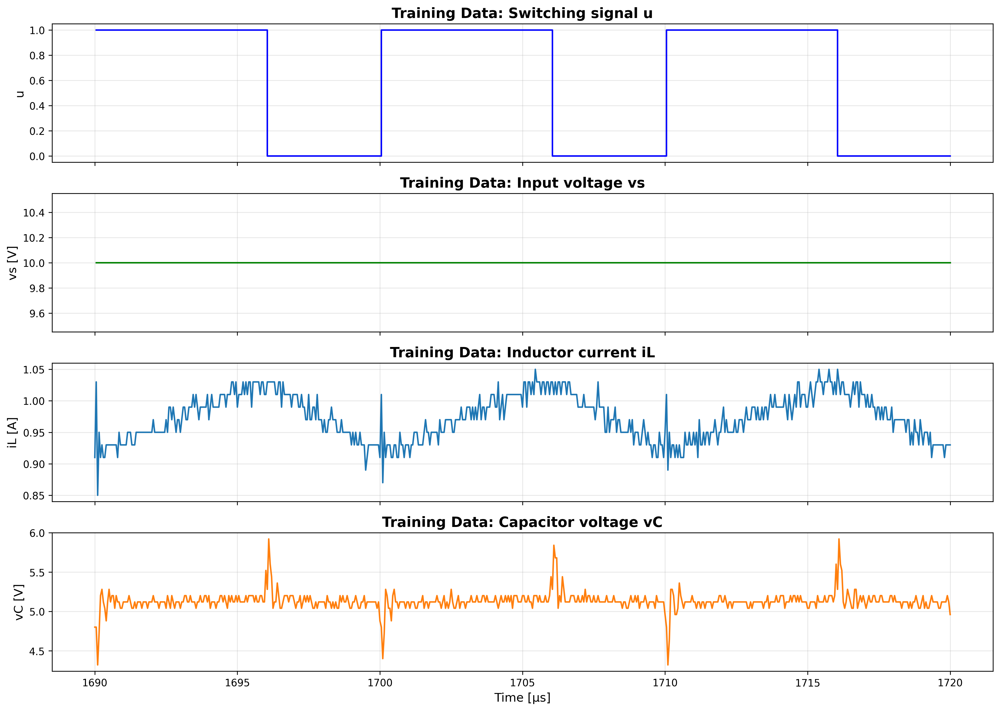
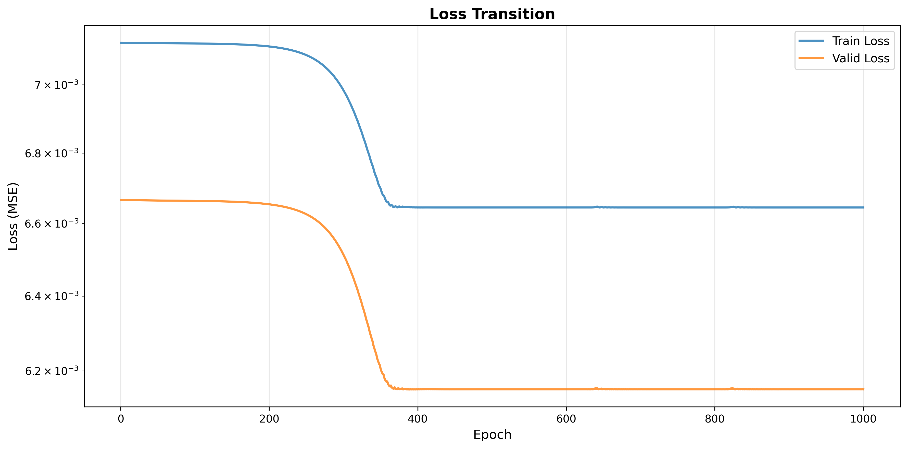
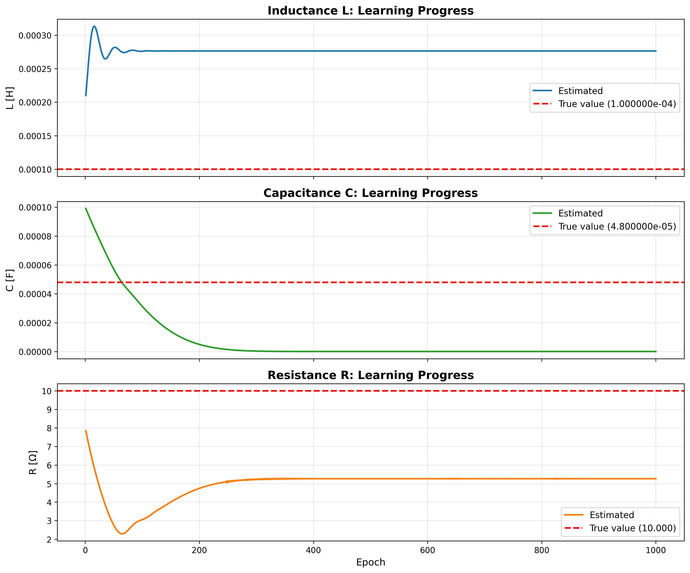
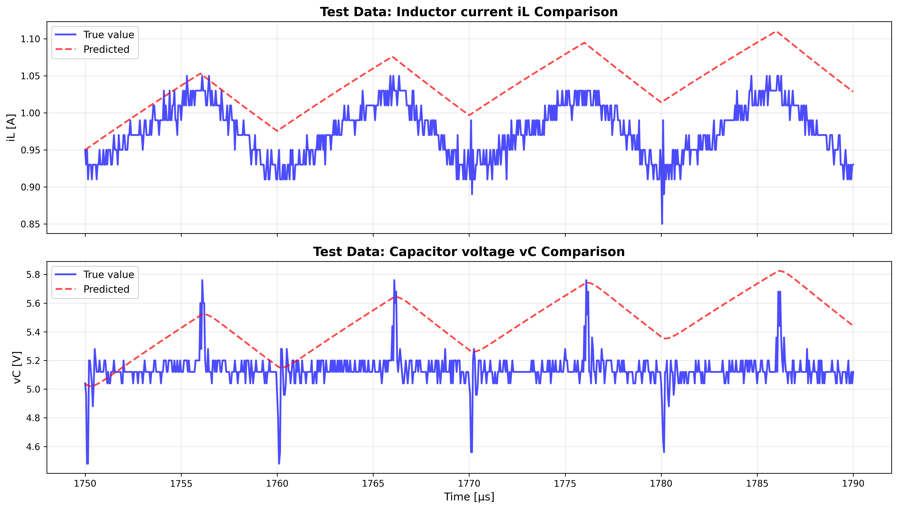

# actual_machine_notebooks/note1.ipynb 実行ログ

実行日時: 2025-12-04 18:30:25

---

## 最終結果

```
============================================================

【回路パラメータ】
  真の値: L = 1.000000e-04 [H], C = 4.800000e-05 [F], R = 10.000 [Ω]
  初期値: L = 2.000000e-04 [H], C = 1.000000e-04 [F], R = 8.000 [Ω]
  推論値: L = 2.763907e-04 [H], C = 5.762465e-08 [F], R = 5.260 [Ω]

【入力条件】
  Vin (入力電圧) = 10.00 [V], Vref (目標電圧) = 6.00 [V]
  スイッチング周波数 f_sw = 100000 [Hz]
  プロット数 = 2001

【データ分割】
  シミュレーション時間: 100.0μs
  1690.0μs ~ 1790.0μs
  2001ステップ
  学習データ: 600 ステップ
  検証データ: 600 ステップ
  テストデータ: 801 ステップ

【最終Loss】
  学習データ: 6.644800e-03
  検証データ: 6.151487e-03
  テストデータ: 5.563519e-03

【学習設定】
  エポック数: 1000
  学習率: L = 5.00e-02, C = 1.00e-02, R = 2.00e-02
```

## 学習データ



## Lossの遷移



## 回路パラメータの学習による変化



## 学習済みモデルでの予測結果



