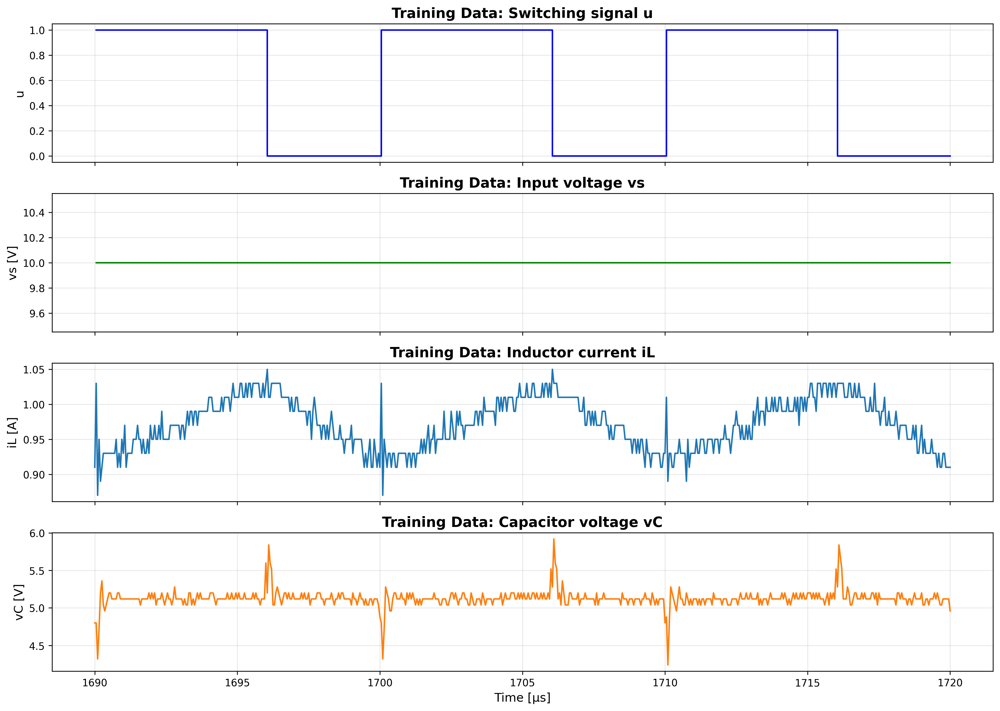
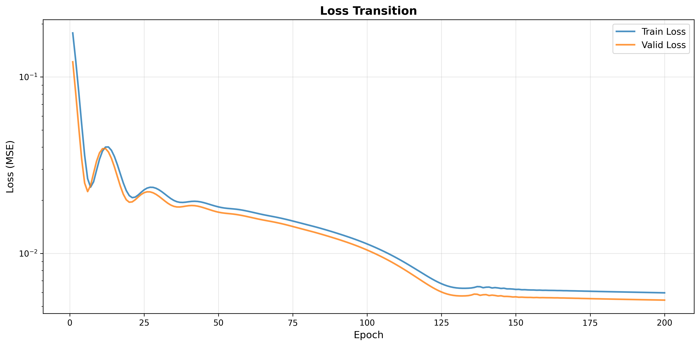
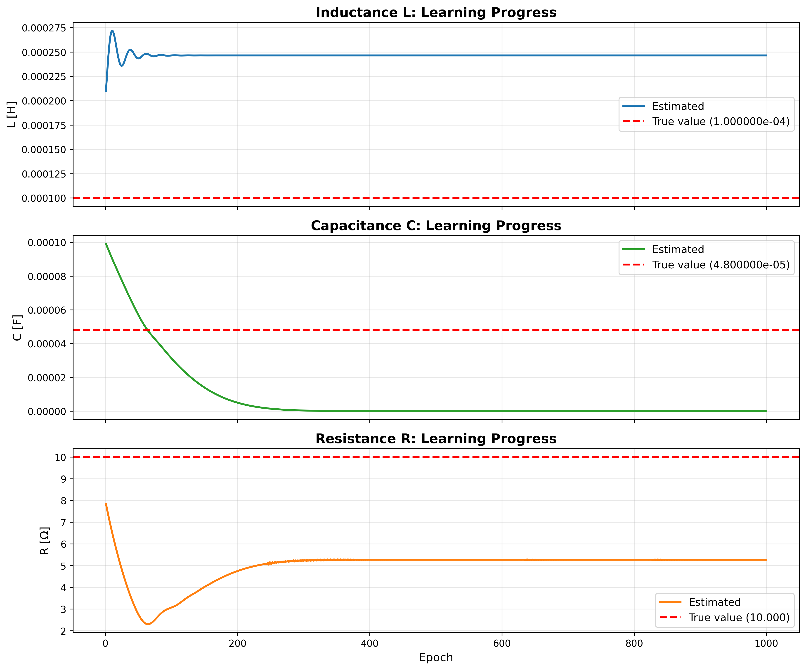
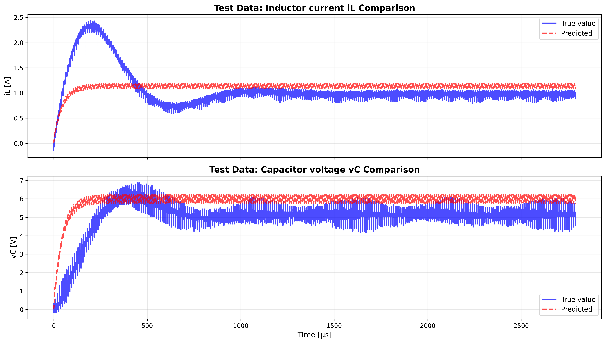
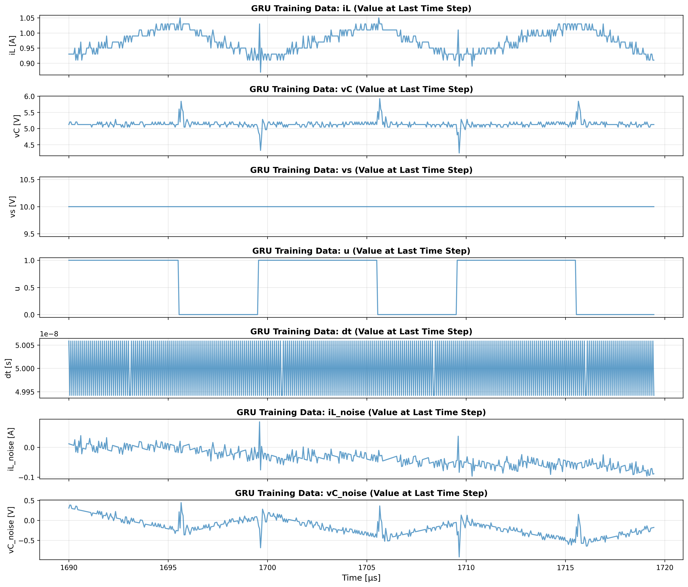
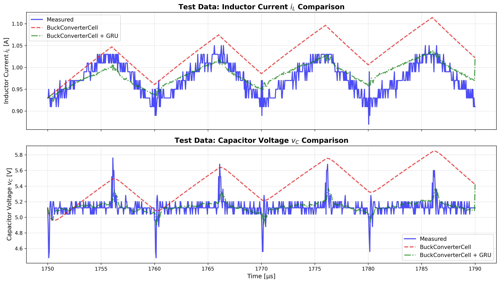
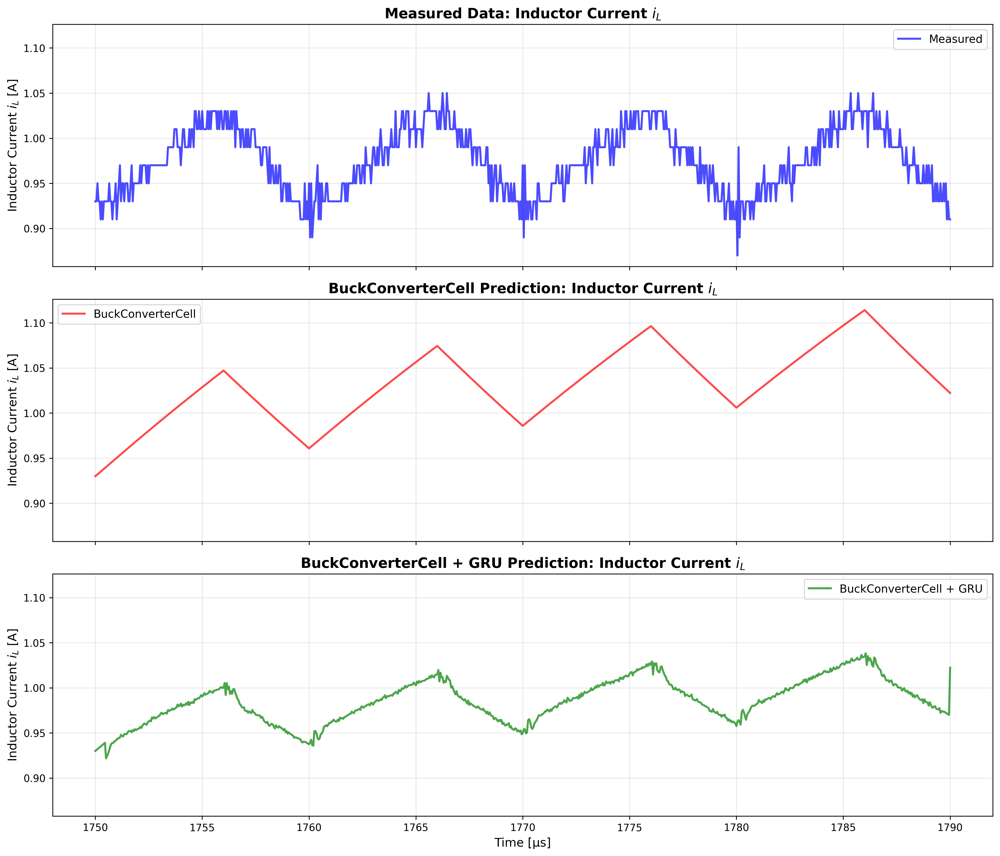
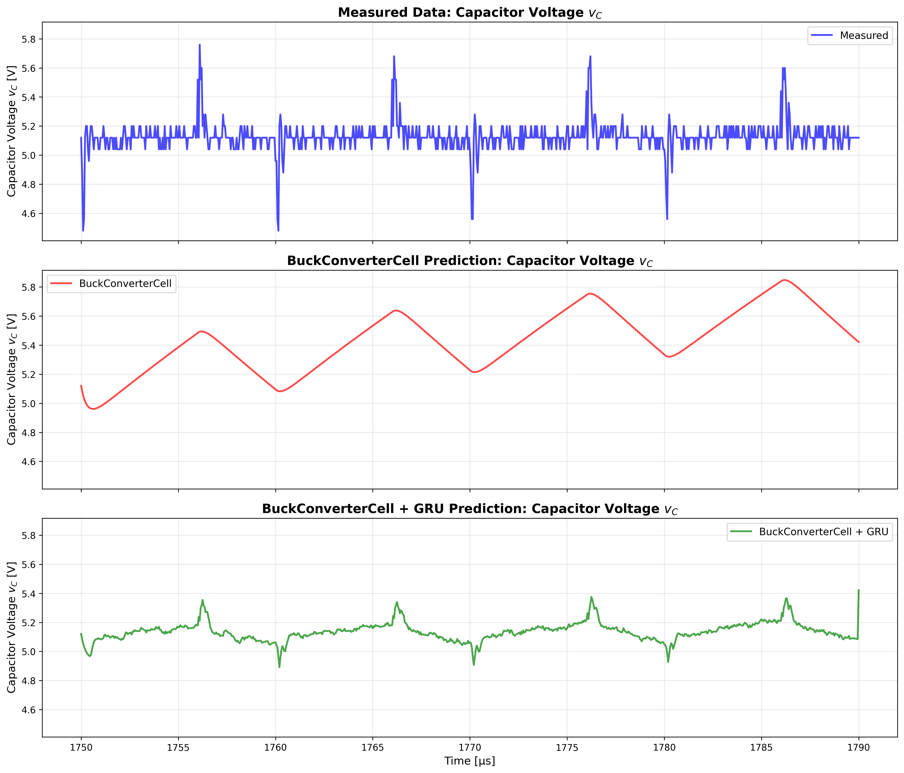

# actual_machine_notebooks/note1/note1.ipynb 実行ログ

実行日時: 2025-12-08 14:43:13

---

## 最終結果

```
=== Buck Converter Cell ===

【回路パラメータ】
  初期値: L = 2.000000e-04 [H], C = 1.000000e-04 [F], R = 8.000 [Ω]
  推論値: L = 2.464634e-04 [H], C = 6.074582e-08 [F], R = 5.267 [Ω]

【入力条件】
  Vin (入力電圧) = 10.00 [V], Vref (目標電圧) = 6.00 [V]
  スイッチング周波数 f_sw = 100000 [Hz]
  1周期あたりのプロット数 = 200

【データ分割】
  シミュレーション時間: 10周期 = 100.0μs
  学習データ: 600 ステップ
  検証データ: 600 ステップ
  テストデータ: 801 ステップ

【最終Loss】
  学習データ: 6.635875e-03
  検証データ: 6.009395e-03
  テストデータ: 5.414745e-03

【学習設定】
  エポック数: 1000
  学習率: L = 5.00e-02, C = 1.00e-02, R = 2.00e-02
=== GRU ===
  エポック数: 200
  学習率: 1.00e-03
```

## Buck Converter Cell モデル構造


## GRU モデル構造


## 学習データ



## Lossの遷移



## 回路パラメータの学習による変化



## テストデータでの予測結果


## シミュレーション結果



## GRU 学習データ



## Lossの遷移


## Comparison of BuckConverterCell + GRU prediction and measured data



## Inductor Current $i_L$: Separate predictions



## Capacitor Voltage $v_C$: Separate predictions



