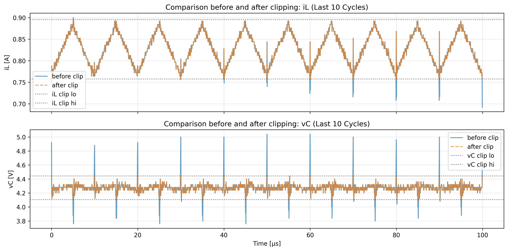
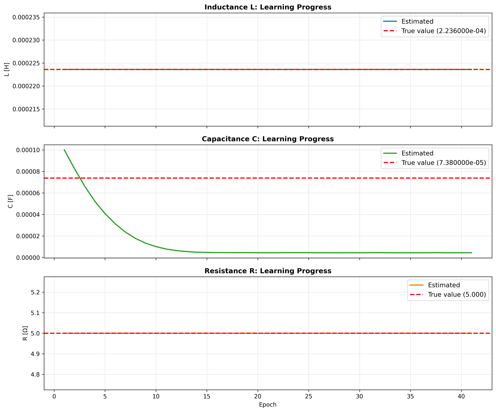
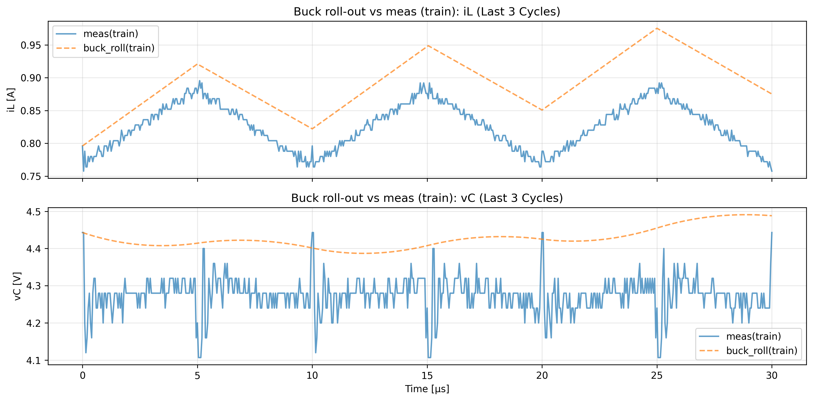
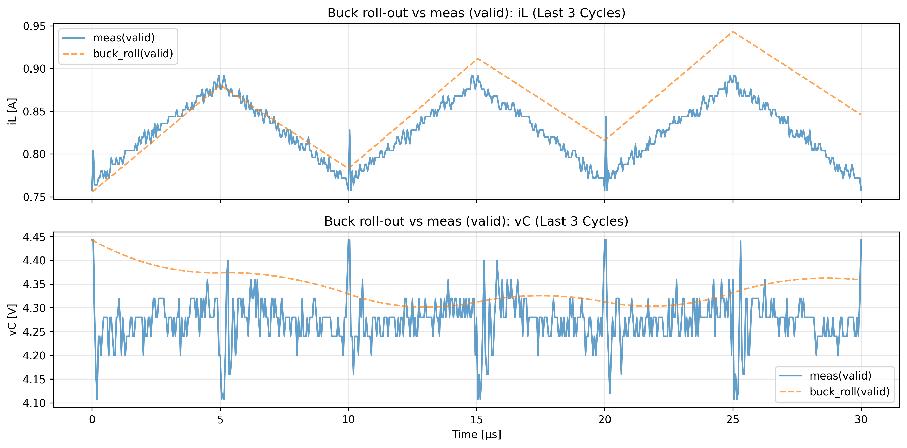
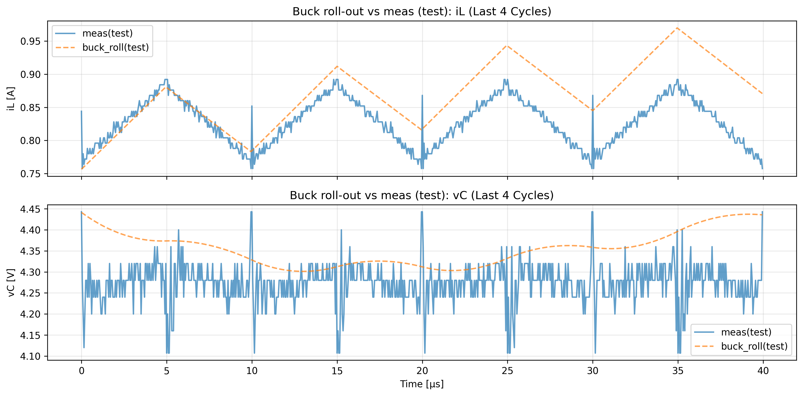
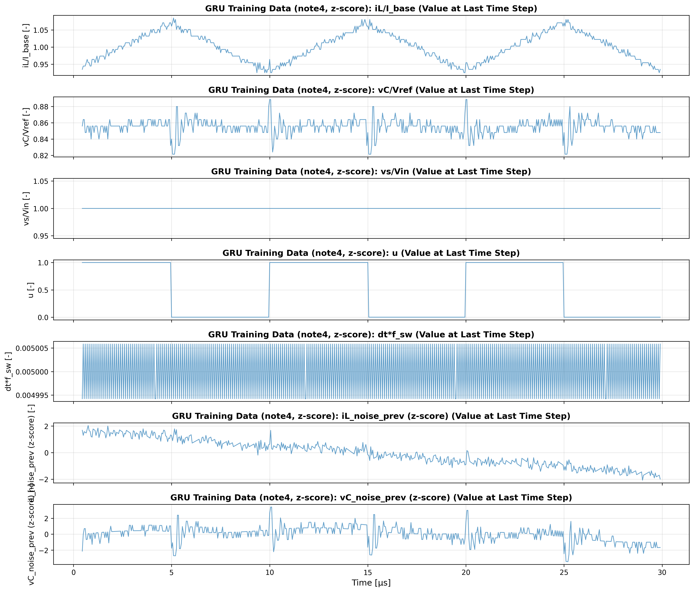
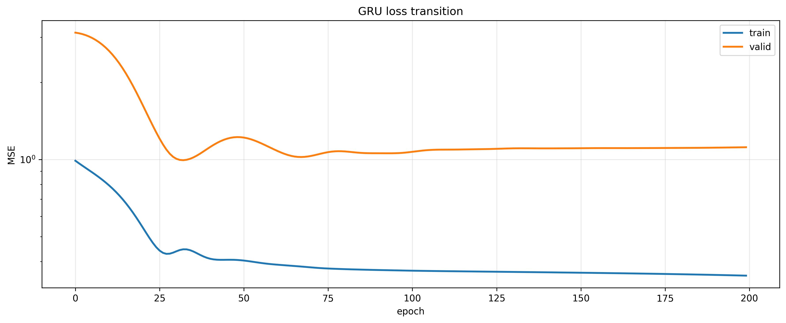
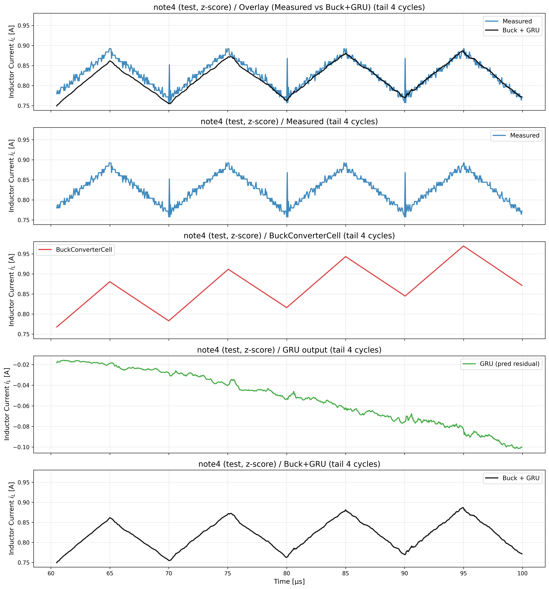
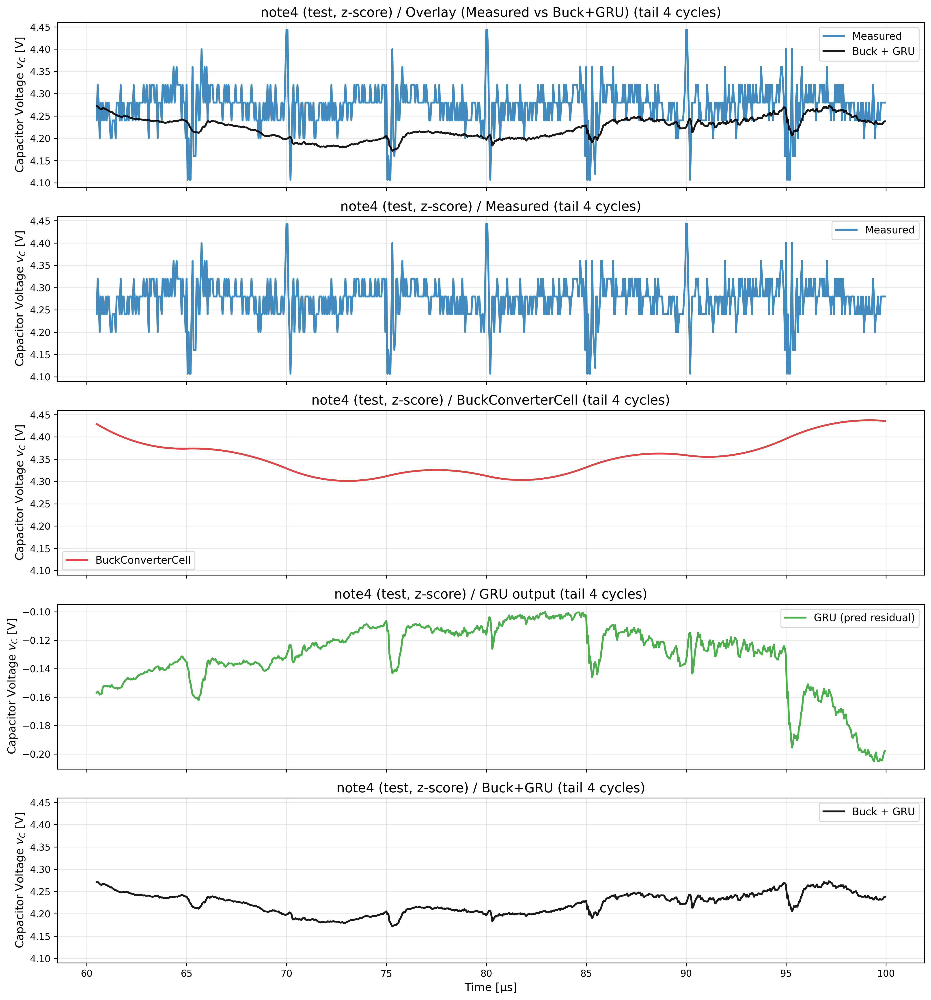

# actual_machine_notebooks/note4/note.ipynb 実行ログ

実行日時: 2025-12-22 17:12:42

---

# 目的

C の回路パラメータの推論がうまくいかないので、\
L と R の回路パラメータを固定して学習させたら、C の推定値がうまくいくのではないか？

結論: うまくいかない、固定させてない時と対して変わらない

## Params

```
C_init: 0.0001
C_true: 7.38e-05
L_init: 0.0002
L_true: 0.0002236
R_init: 8.0
R_true: 5
T: 1e-05
Vin: 10.0
Vref: 5.0
batch_size: 256
clipped_k: 2.0
cycles: 1200
data_path: ../../data/csv/tek0003ALL.csv
duty: 0.5
epochs_buck: 8000
epochs_gru: 200
f_sw: 100000.0
grad_clip_norm: 5.0
gru_lr: 0.001
lr_c: 0.001
lr_l: 0.005
lr_r: 0.002
noise_std_iL: 0.02
noise_std_vC: 0.02
samples_per_cycle: 200
seq_length: 10
title: LとRの回路パラメータを固定して学習させる
train_cycles: 10
train_ratio: 0.3
valid_ratio: 0.3
win_len: 50
```



## Buck 推定値

```
L_hat=2.236000e-04
C_hat=4.459650e-06
R_hat=5.000000e+00

```

## Buck 損失遷移


## Buck パラメータ推定の推移



## Buck rollout 比較(train)



## Buck rollout 比較(valid)



## Buck rollout 比較(test)



## GRU noise z-score stats

```
[GRU noise z-score stats]
noise_mean_scaled=[-0.0803582 -0.0306033]
noise_std_scaled =[0.02908219 0.01144611]
noise_train_z_mean=[-1.04904174e-07  1.38282772e-07]
noise_train_z_std =[1.         0.99999994]

```

## GRU 学習データ（特徴量・全体, z-score）



## GRU 損失遷移



## GRU 評価

```
GRU test loss=9.524695e-01

```

## iL: Measured / Buck / GRU / Buck+GRU（末尾 4 周期, z-score）



## vC: Measured / Buck / GRU / Buck+GRU（末尾 4 周期, z-score）



## Buck+GRU 評価(test, z-score)

```
MSE(all) buck=6.716443e-03
MSE(all) buck+gru=2.589599e-03
MSE(iL) buck=3.109925e-03
MSE(iL) buck+gru=2.264950e-04
MSE(vC) buck=1.032296e-02
MSE(vC) buck+gru=4.952702e-03

```

## Summary

```
【回路パラメータ】
  真の値: L = 2.236000e-04 [H], C = 7.380000e-05 [F], R = 5.000 [Ω]
  初期値: L = 2.000000e-04 [H], C = 1.000000e-04 [F], R = 8.000 [Ω]
  推論値: L = 2.236000e-04 [H], C = 4.459650e-06 [F], R = 5.000 [Ω]
```
