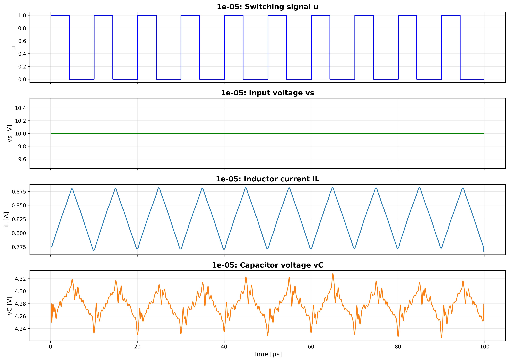
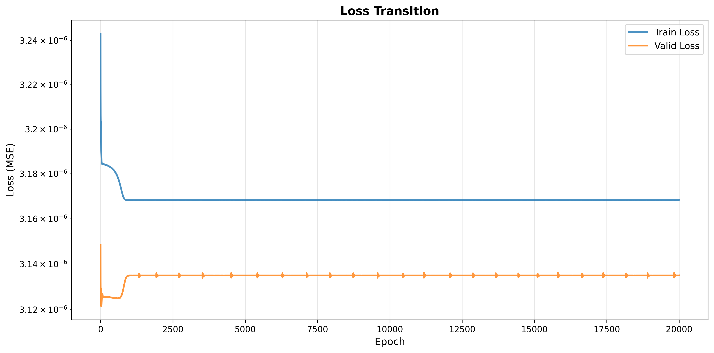
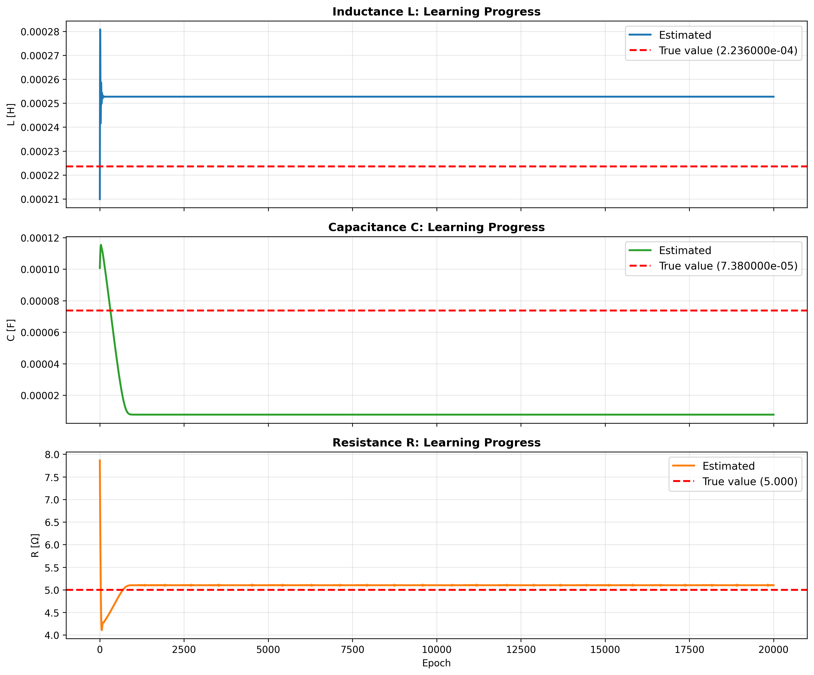
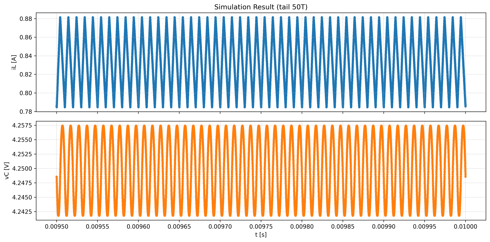
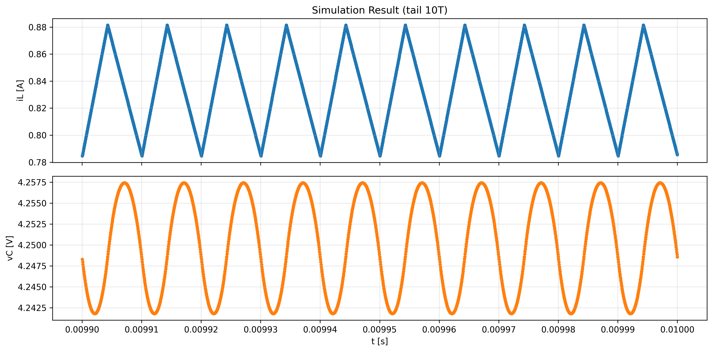
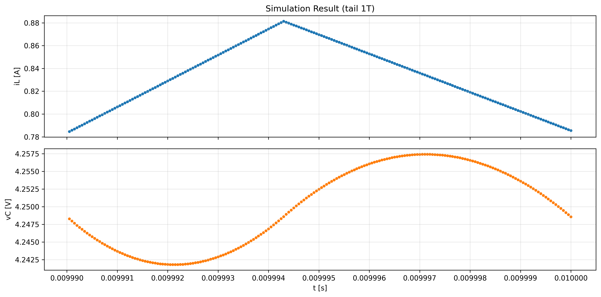
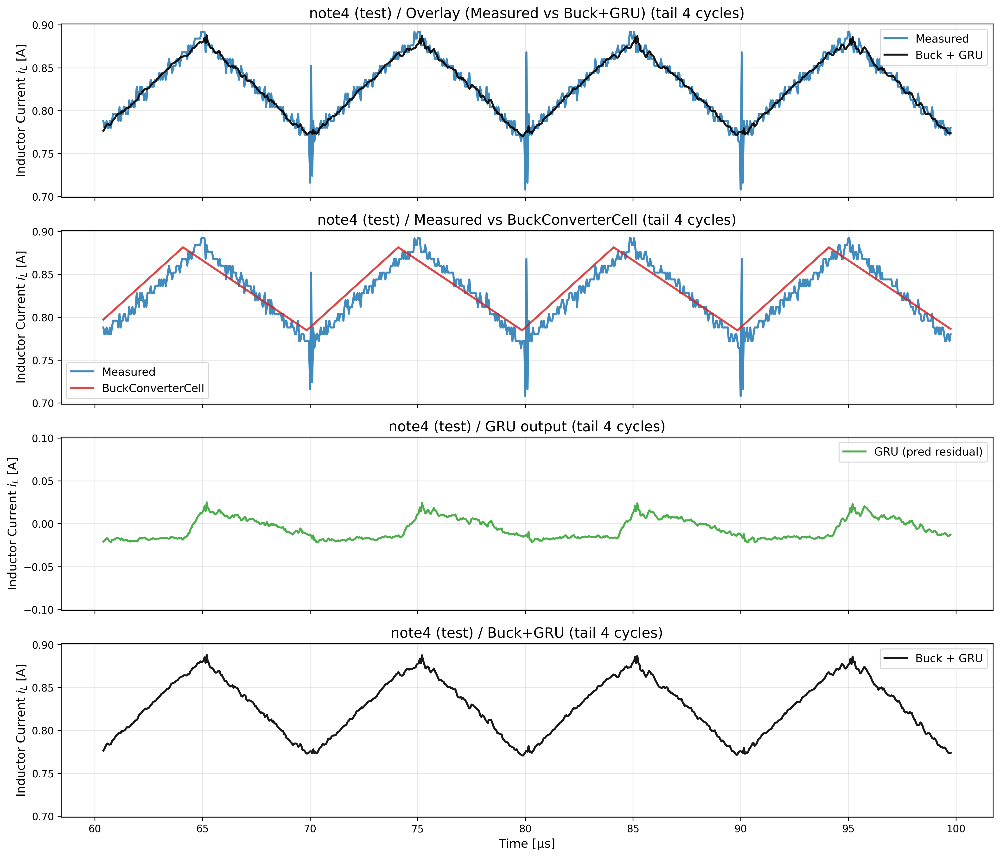

# actual_machine_notebooks/note4/note.ipynb 実行ログ

実行日時: 2025-12-24 18:33:23

---

# 主な変更点

1. 今まで duty を 0.5 で固定していたが、それだと BuckConverterCell の出力がほぼ Vin\*0.5 で固定されてしまうので、実機データの vC の平均値を用いて duty を計算するようにした
2. 実機データの iL と vC に FIR フィルターをかけて滑らかになるようにしてから BuckConverterCell の学習に使うようにした

## 実機データ(加工前)

_0.png>)

_1.png>)

## BuckConverterCell の入力波形

FIR フィルターをかけてからダウンサンプリング

scipy の firwin を使って FIR フィルターをかけている。
[scipy.signal.firwin](https://docs.scipy.org/doc/scipy/reference/generated/scipy.signal.firwin.html)

## BuckConverterCell の学習結果 Loss の遷移

## 回路パラメータの学習による変化

## シミュレーション結果(0 から 1000 周期までシミュレーションし、定常箇所と実機のデータの比較)

## シミュレーション結果

## GRU 学習データ

## GRU Loss の遷移

## GRU noise 予測(テスト)

## iL: Measured / Buck / GRU / Buck+GRU（末尾 4 周期）

## vC: Measured / Buck / GRU / Buck+GRU（末尾 4 周期）

