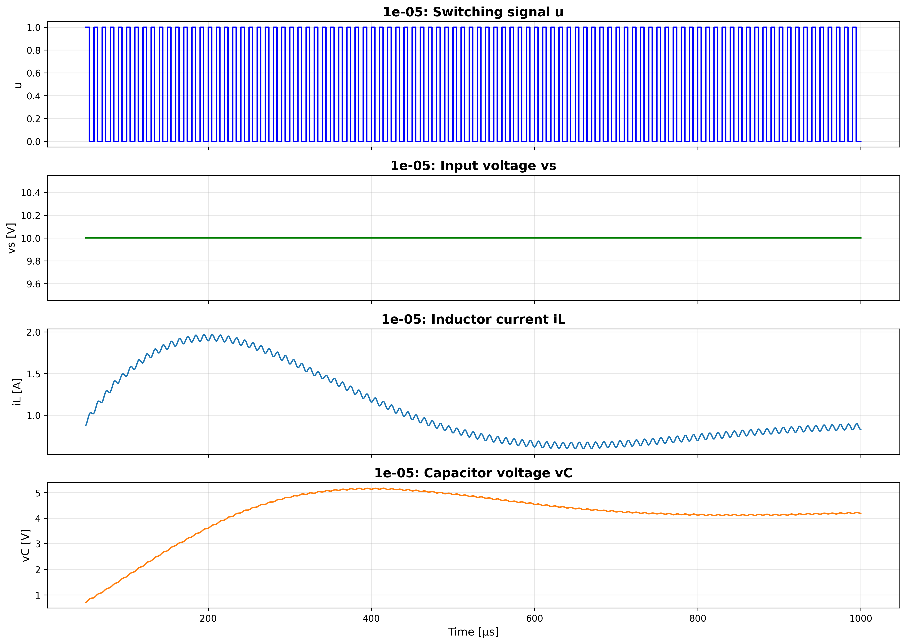
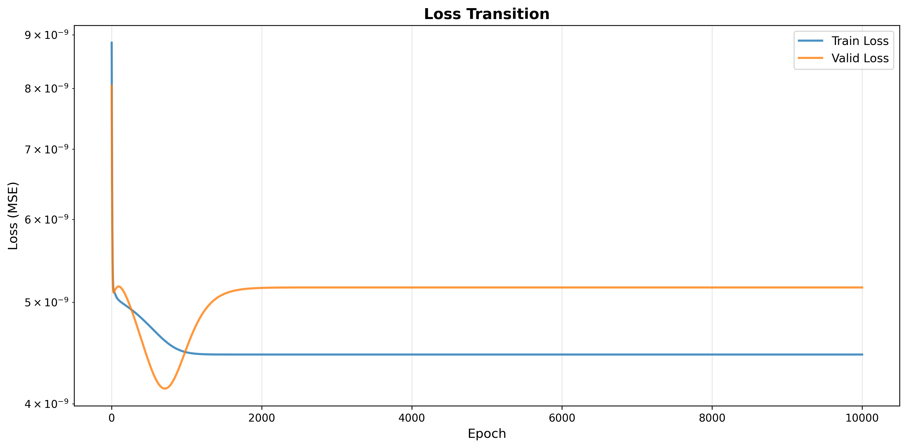
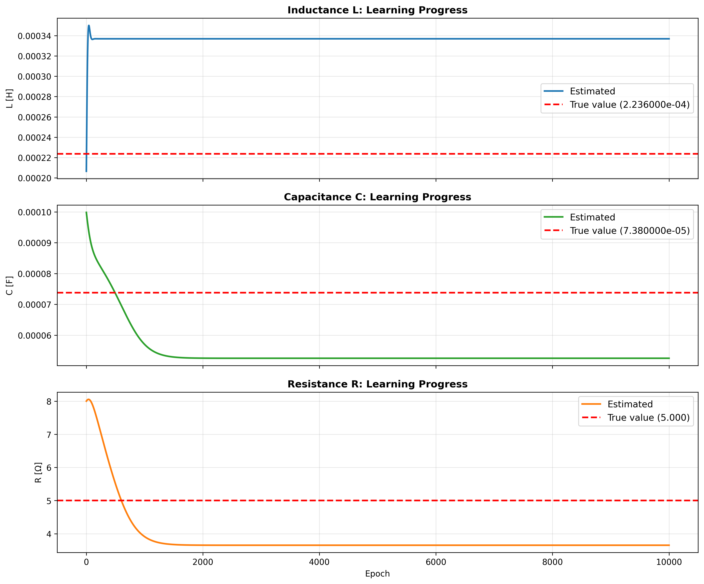

# actual_machine_notebooks/note4/note.ipynb 実行ログ

実行日時: 2026-01-08 12:02:29

---

## 実機データ(加工前)

_0.png>)

_1.png>)

_2.png>)

## BuckConverterCell の入力波形

最初の 5~100 周期分を学習データとして切り出し、ダウンサンプリング(1 周期あたり 1000 プロット程度)

## BuckConverterCell の学習結果\_Loss の遷移

## 回路パラメータの学習による変化

学習された各パラメータ

- L=336.8µH (true=223.6)
- C=52.5µF (true=73.8)
- R=3.65Ω (true=5.0)

以前、定常部分だけで学習した時 ↓

- L=276.7µH (true=223.6)
- C=15.3µF (true=73.8)
- R=5.10Ω (true=5.0)

L と R は定常のみで学習した方が良いが C は今回の過渡部分の方が良さそう

まあそれでも 52.5 ↔ 73.8 で結構違うのでどのみち実機の C パラメータが推論できているとは言えない気がする

