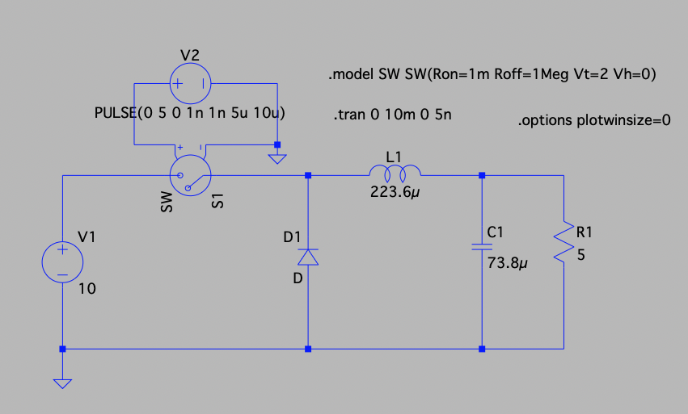
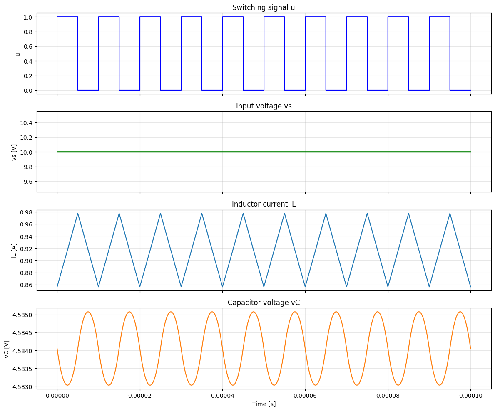

# 進捗報告 ?/?(?)

長崎大学工学部工学科 B4 丸田研究室\
35221011 大塚直哉

---

# 一旦現状をまとめる

- コンバータの仕様
- シミュレーションデータ
  - RNN のみ
  - GRU のみ
  - 合わせたやつ
- 実機データ
  - RNN のみ
  - GRU のみ
  - 合わせたやつ

# コンバータの仕様

- スイッチング信号 $u[k]$ は $\{0,1\}$ の 2 値をとる
  - $u[k]=1$ のときスイッチ ON
  - $u[k]=0$ のときスイッチ OFF
- $v_s[k]$ は、入力電圧 $V_{\mathrm{in}}$ とスイッチング信号 $u[k]$ の積で表される

  - $v_s[k] = V_{\mathrm{in}} \cdot u[k]$

- インダクタ電流 $i_L[k+1]$ の更新式:

  $$
  i_L[k+1] = i_L[k] + \frac{\Delta t_k}{L} \left( v_s[k] - v_C[k] \right)
  $$

- 出力コンデンサ電圧 $v_C[k+1]$ の更新式:

  $$
  v_C[k+1] = v_C[k] + \frac{\Delta t_k}{C} \left( i_L[k] - \frac{v_C[k]}{R_{\mathrm{o}}} \right)
  $$

## 回路パラメータ（シミュレーション・実験共通の標準値）

| パラメータ         | 記号                  | 真値    | 初期値 | 単位            | 備考 |
| ------------------ | --------------------- | ------- | ------ | --------------- | ---- |
| インダクタ         | $L$                   | $223.6$ | $200$  | $\mu\mathrm{H}$ |      |
| キャパシタ         | $C$                   | $73.8$  | $100$  | $\mu\mathrm{F}$ |      |
| 負荷抵抗           | $R$                   | $5$     | $8.0$  | $\Omega$        |      |
| 入力電圧           | $V_{\mathrm{in}}$     | $10$    | -      | $\mathrm{V}$    |      |
| スイッチング周波数 | $f_{\mathrm{sw}}$     | $100$   | -      | $\mathrm{kHz}$  |      |
| スイッチング周期   | $T=1/f_{\mathrm{sw}}$ | $10$    | -      | $\mu\mathrm{s}$ |      |

# シミュレーションデータ

## RNN のみ

### 使用データ

- **データソース**: ltspice による 10ms（1000 周期）シミュレーションの後ろ 10 周期分を使用
- **データ分割**:
  - 学習（train） : 3 周期
  - バリデーション（valid） : 3 周期
  - テスト（test） : 4 周期
- **サンプリング数**: 1 周期あたり 200 プロット、合計 2000 プロット
- **学習設定**:
  - エポック数 : 10000
  - 学習率:
    - $L$: 5e-2
    - $C$: 1e-2
    - $R$: 2e-2

### 学習データ

### パラメータ推定結果

|               | インダクタ $L$ | キャパシタ $C$ |  抵抗 $R$  |
| :-----------: | :------------: | :------------: | :--------: |
|  **真の値**   | 2.2360e-04 [H] | 7.3800e-05 [F] | 5.000 [Ω]  |
|  **初期値**   | 2.0000e-04 [H] | 1.0000e-04 [F] | 8.000 [Ω]  |
|  **推論値**   | 2.0795e-04 [H] | 7.4234e-05 [F] | 5.000 [Ω]  |
| **推定誤差 ** |   7.0006 [%]   |   0.5880 [%]   | 0.0016 [%] |

### パラメータ推移（学習過程）

### 学習済みモデルと教師データの比較

- 青: 教師データ
- オレンジ: 学習済みモデル出力

## GRU のみ

# 実機データ
