# 進捗報告 ?/?(?)

長崎大学工学部工学科 B4 丸田研究室\
35221011 大塚直哉

---

# 一旦現状をまとめる

- コンバータの仕様
- シミュレーションデータ
  - RNN のみ
  - GRU のみ
  - 合わせたやつ
- 実機データ
  - RNN のみ
  - GRU のみ
  - 合わせたやつ

# コンバータの仕様

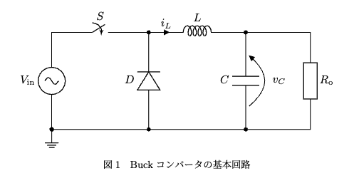

- スイッチング信号 $u[k]$ は $\{0,1\}$ の 2 値をとる
  - $u[k]=1$ のときスイッチ ON
  - $u[k]=0$ のときスイッチ OFF
- $v_s[k]$ は、入力電圧 $V_{\mathrm{in}}$ とスイッチング信号 $u[k]$ の積で表される

  - $v_s[k] = V_{\mathrm{in}} \cdot u[k]$

- インダクタ電流 $i_L[k+1]$ の更新式:

  $$
  i_L[k+1] = i_L[k] + \frac{\Delta t_k}{L} \left( v_s[k] - v_C[k] \right)
  $$

- 出力コンデンサ電圧 $v_C[k+1]$ の更新式:

  $$
  v_C[k+1] = v_C[k] + \frac{\Delta t_k}{C} \left( i_L[k] - \frac{v_C[k]}{R_{\mathrm{o}}} \right)
  $$

## 回路パラメータ（シミュレーション・実験共通の標準値）

| パラメータ         | 記号                  | 真値    | 初期値 | 単位            |
| ------------------ | --------------------- | ------- | ------ | --------------- |
| インダクタ         | $L$                   | $223.6$ | $200$  | $\mu\mathrm{H}$ |
| キャパシタ         | $C$                   | $73.8$  | $100$  | $\mu\mathrm{F}$ |
| 負荷抵抗           | $R$                   | $5$     | $8$    | $\Omega$        |
| 入力電圧           | $V_{\mathrm{in}}$     | $10$    | -      | $\mathrm{V}$    |
| スイッチング周波数 | $f_{\mathrm{sw}}$     | $100$   | -      | $\mathrm{kHz}$  |
| スイッチング周期   | $T=1/f_{\mathrm{sw}}$ | $10$    | -      | $\mu\mathrm{s}$ |

# シミュレーションデータ

## RNN のみ 過渡状態のみ

### 使用データ

- **データソース**: シミュレーションデータの後ろ 10 周期分を使用
- **サンプリング数**: 1 周期あたり 200 プロット、合計 2000 プロット
- **学習設定**:
  - エポック数 : 10000
  - 学習率:
    - $L$: 5e-2
    - $C$: 1e-2
    - $R$: 2e-2

### 学習データ

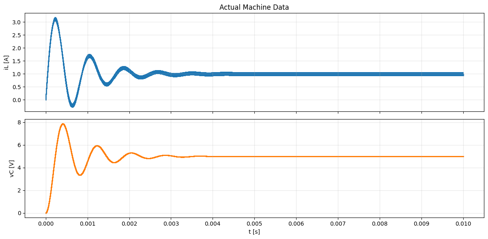
.png>)

### パラメータ推定結果

|              | インダクタ $L$ | キャパシタ $C$ | 抵抗 $R$ |
| :----------: | :------------: | :------------: | :------: |
|  **真の値**  | 2.236e-04 [H]  | 7.3800e-05 [F] | 5.00 [Ω] |
|  **初期値**  | 2.000e-04 [H]  | 1.000e-04 [F]  | 8.00 [Ω] |
|  **推論値**  | 2.322e-04 [H]  | 7.410e-05 [F]  | 5.00 [Ω] |
| **推定誤差** |    3.83 [%]    |    0.46 [%]    | 0.01 [%] |

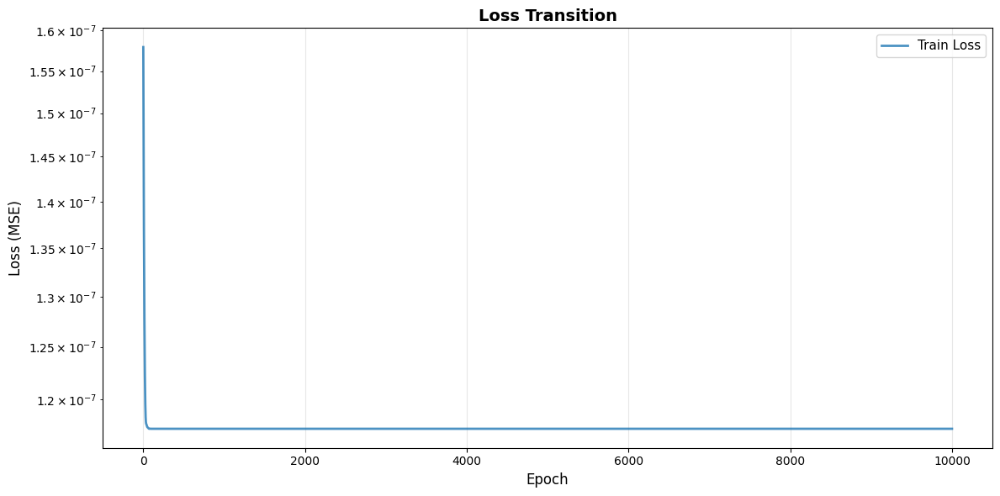

### パラメータ推移（学習過程）

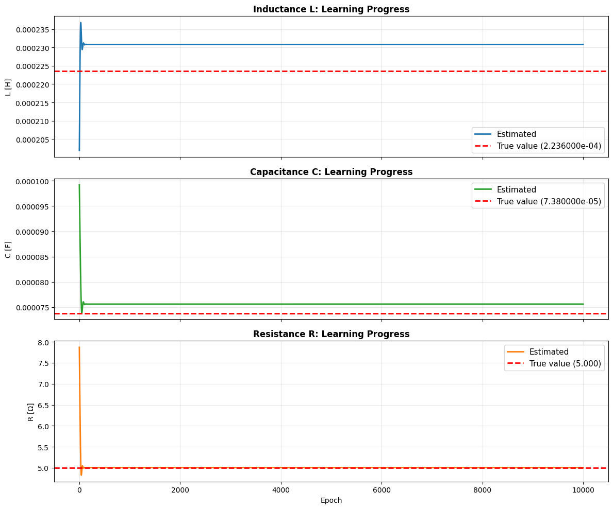

### 学習済みモデルと教師データの比較

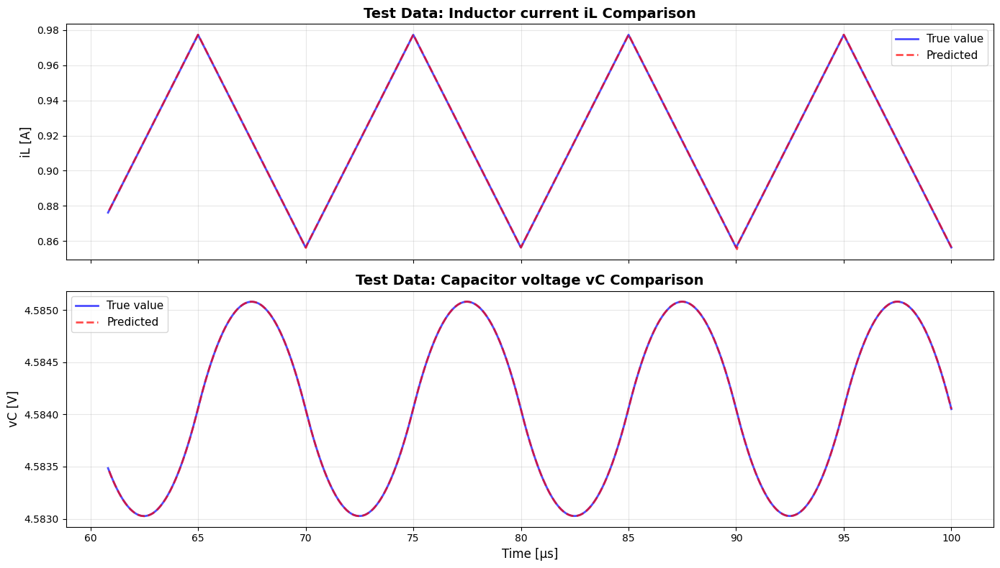

- 不連続が含まれているのに、BuckConverterCell では不連続を考慮していない

## GRU のみ 過渡状態のみ

### 学習データ

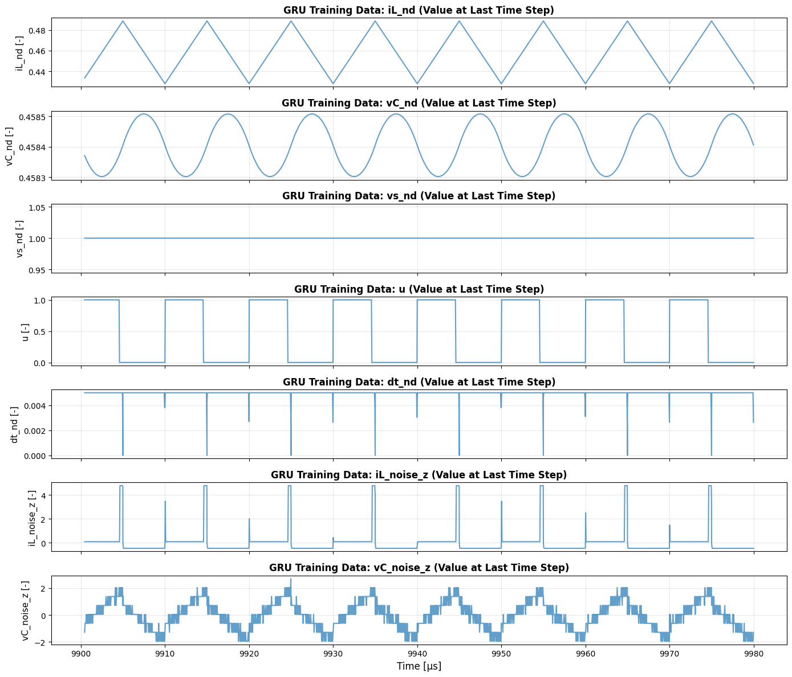

- iL, vC, dt は物理基準で無次元化し、iL_nd, vC_nd, dt_nd として扱っている

  - iL_nd = iL / (Vin / R_pred)
  - vC_nd = vC / Vin
  - dt_nd = dt / T

- iL_noise, vC_noise は、訓練データで平均と標準偏差を求めて z-score 標準化（iL_noise_z, vC_noise_z）している

（詳細は [note5/note.ipynb](../../actual_machine_notebooks/note5/note.ipynb) の Scalers クラス・fit_scalers_physics 関数を参照）

### 結果

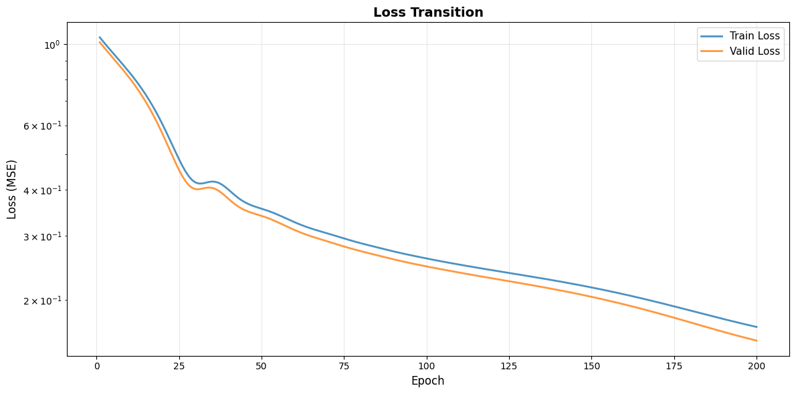

## BuckConverterCell + GRU 推論結果

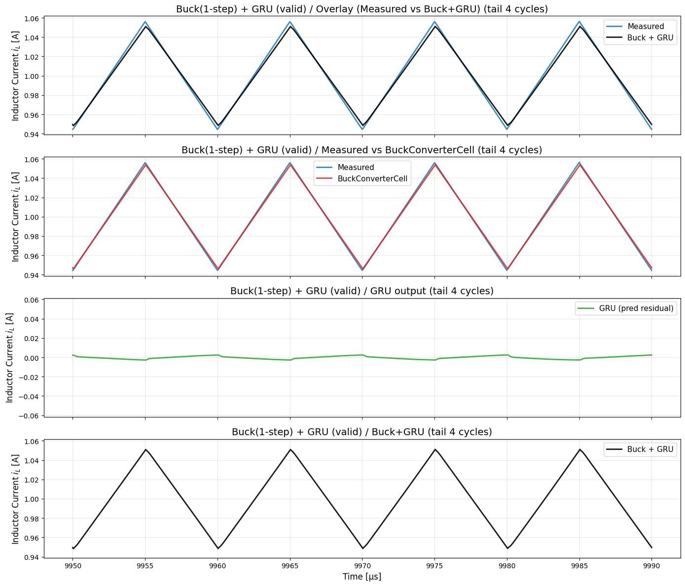

# 実機データ

## RNN のみ 過渡状態のみ

### 使用データ

- **データソース**: 実機データの後ろ 10 周期分を使用
- **サンプリング数**: 1 周期あたり 200 プロット、合計 2000 プロット
- **学習設定**:
  - エポック数 : 10000
  - 学習率:
    - $L$: 5e-2
    - $C$: 1e-2
    - $R$: 2e-2

### 学習データ

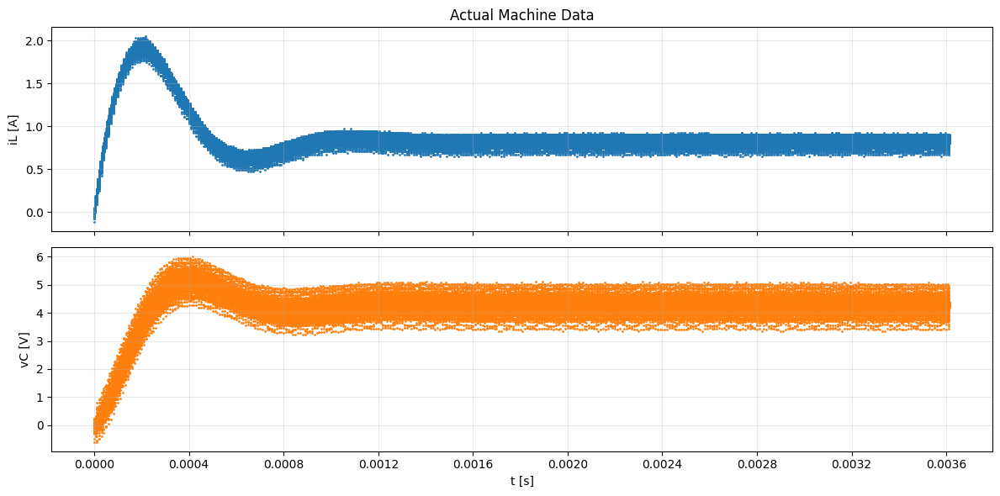
.png>)

### パラメータ推定結果

|              | インダクタ $L$ | キャパシタ $C$ | 抵抗 $R$ |
| :----------: | :------------: | :------------: | :------: |
|  **真の値**  | 2.236e-04 [H]  | 7.3800e-05 [F] | 5.00 [Ω] |
|  **初期値**  | 2.000e-04 [H]  | 1.000e-04 [F]  | 8.00 [Ω] |
|  **推論値**  | 2.507e-04 [H]  | 6.760e-05 [F]  | 4.81 [Ω] |
| **推定誤差** |   12.11 [%]    |    8.45 [%]    | 3.72 [%] |

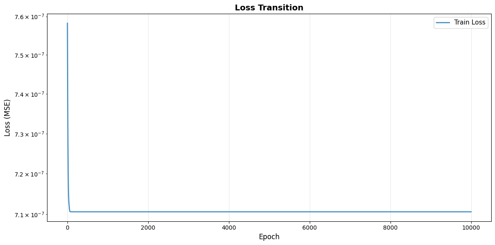

### パラメータ推移（学習過程）

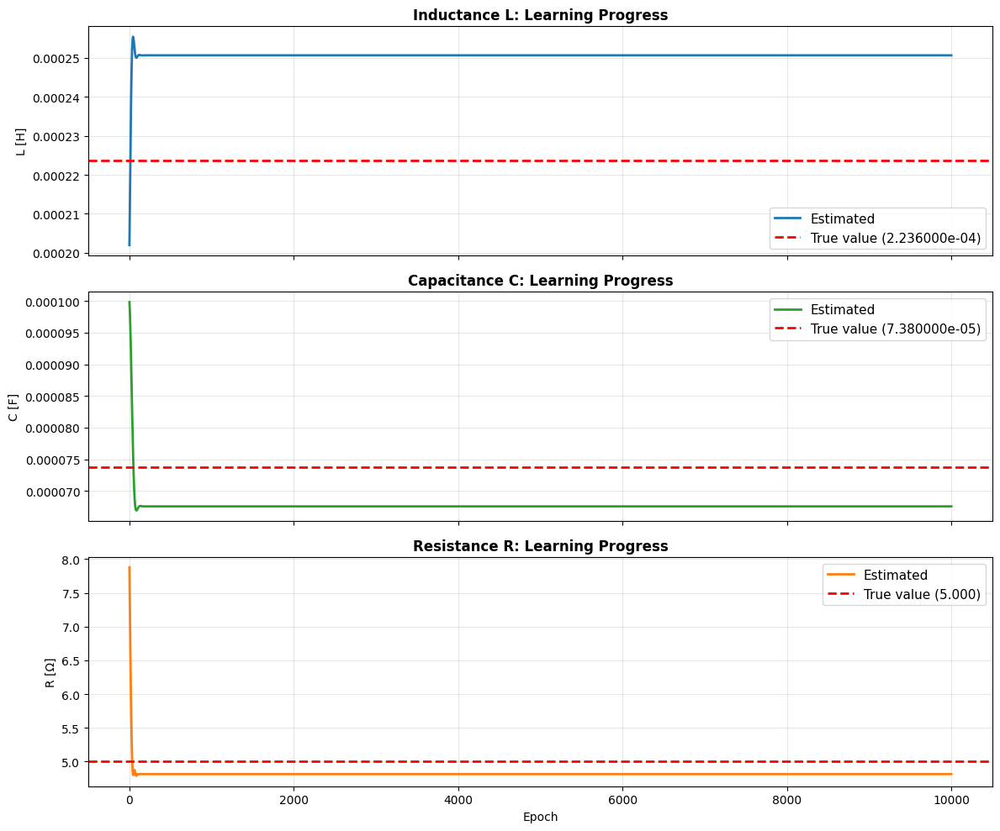

### 学習済みモデルと教師データの比較

- 不連続が含まれているのに、BuckConverterCell では不連続を考慮していない

## GRU のみ 過渡状態のみ

### 学習データ

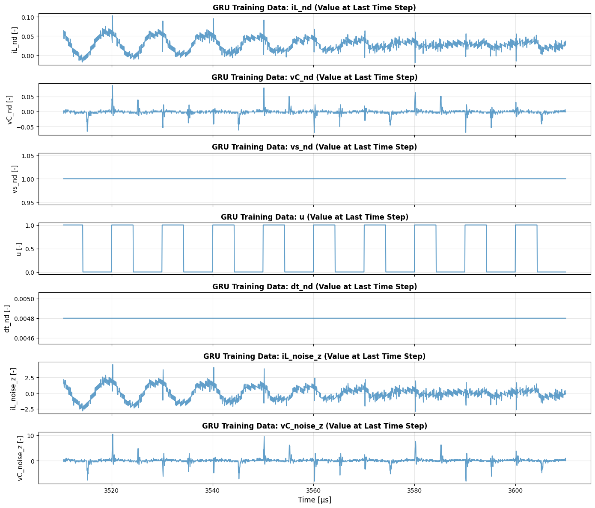

- iL, vC, dt は物理基準で無次元化し、iL_nd, vC_nd, dt_nd として扱っている

  - iL_nd = iL / (Vin / R_pred)
  - vC_nd = vC / Vin
  - dt_nd = dt / T

- iL_noise, vC_noise は、訓練データで平均と標準偏差を求めて z-score 標準化（iL_noise_z, vC_noise_z）している

（詳細は [note5/note.ipynb](../../actual_machine_notebooks/note5/note.ipynb) の Scalers クラス・fit_scalers_physics 関数を参照）

### 結果

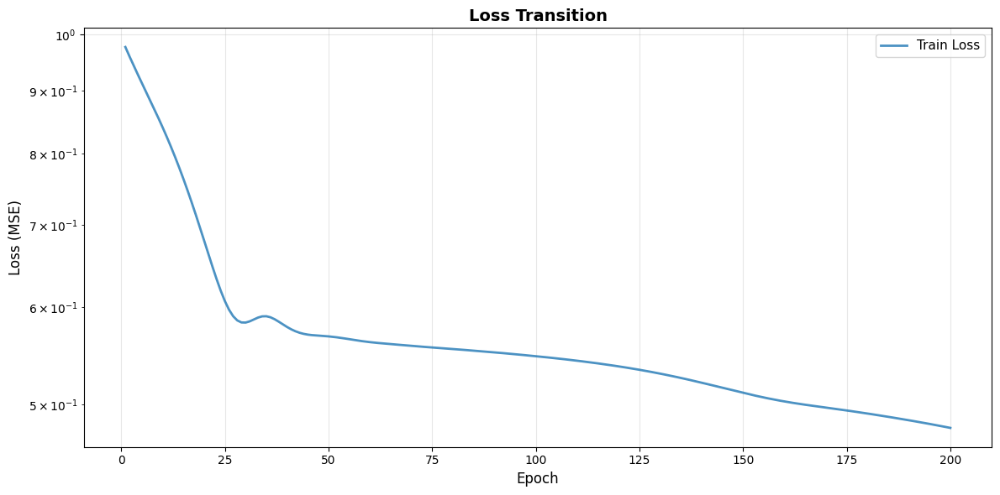

## BuckConverterCell + GRU 推論結果

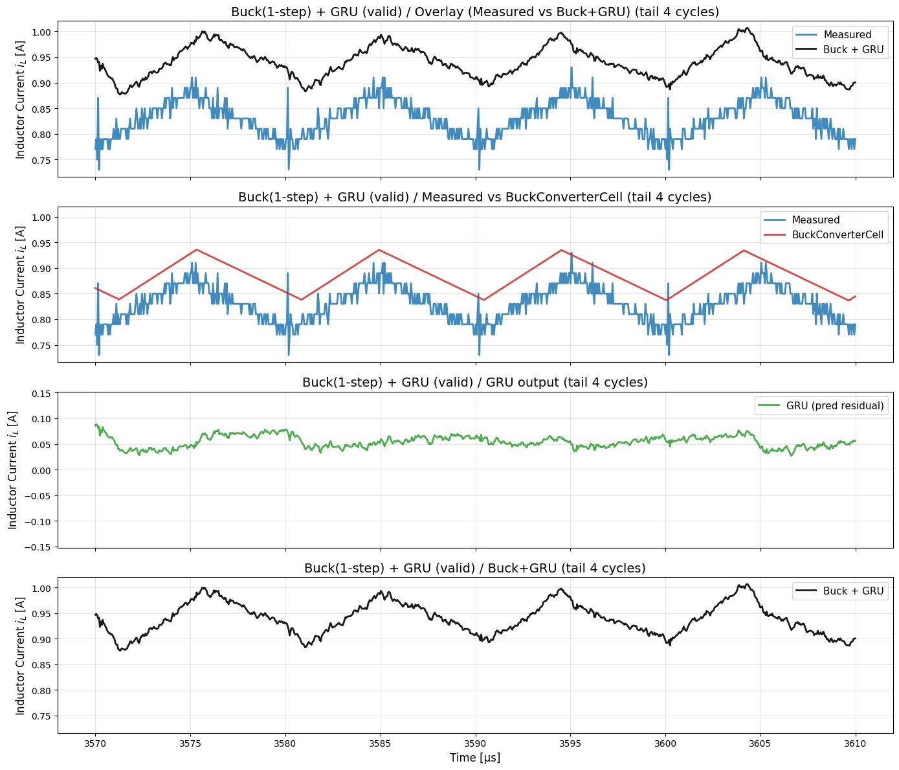
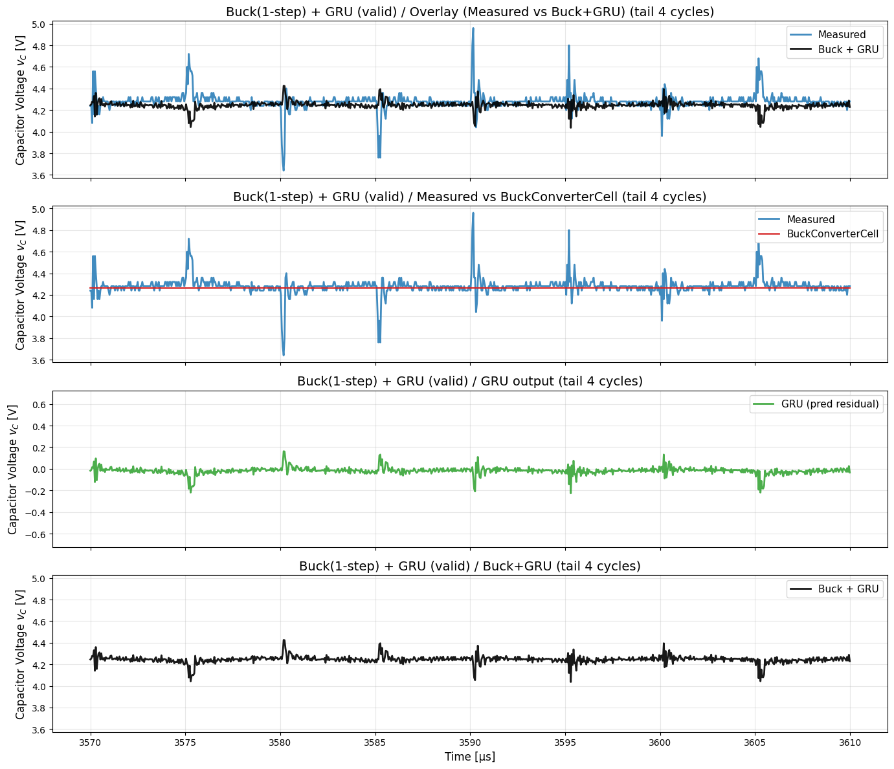
