# 進捗報告 ?/?(?)

長崎大学工学部工学科 B4 丸田研究室\
35221011 大塚直哉

---

# コンバータの仕様

- スイッチング信号 $u[k]$ は $\{0,1\}$ の 2 値をとる
  - $u[k]=1$ のときスイッチ ON
  - $u[k]=0$ のときスイッチ OFF
- $v_s[k]$ は、入力電圧 $V_{\mathrm{in}}$ とスイッチング信号 $u[k]$ の積で表される

  - $v_s[k] = V_{\mathrm{in}} \cdot u[k]$

- インダクタ電流 $i_L[k+1]$ の更新式:

$$i_L[k+1] = i_L[k] + \frac{\Delta t_k}{L} \left( v_s[k] - v_C[k] \right)$$

- 出力コンデンサ電圧 $v_C[k+1]$ の更新式:

$$v_C[k+1] = v_C[k] + \frac{\Delta t_k}{C} \left( i_L[k] - \frac{v_C[k]}{R_{\mathrm{o}}} \right)$$

## 回路パラメータ（シミュレーション・実験共通の標準値）

| パラメータ         | 記号                  | 真値    | 初期値 | 単位            |
| ------------------ | --------------------- | ------- | ------ | --------------- |
| インダクタ         | $L$                   | $223.6$ | $200$  | $\mu\mathrm{H}$ |
| キャパシタ         | $C$                   | $73.8$  | $100$  | $\mu\mathrm{F}$ |
| 負荷抵抗           | $R$                   | $5$     | $8$    | $\Omega$        |
| 入力電圧           | $V_{\mathrm{in}}$     | $10$    | -      | $\mathrm{V}$    |
| スイッチング周波数 | $f_{\mathrm{sw}}$     | $100$   | -      | $\mathrm{kHz}$  |
| スイッチング周期   | $T=1/f_{\mathrm{sw}}$ | $10$    | -      | $\mu\mathrm{s}$ |

# フロー

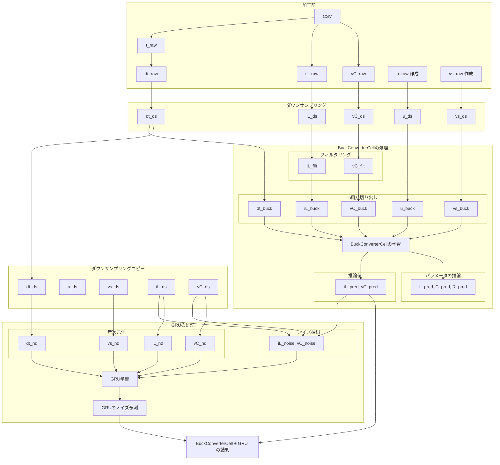

# シミュレーションデータ

## RNN のみ 過渡状態のみ

### 使用データ

- **データソース**: シミュレーションデータの 6~105 周期の 100 周期分
- **サンプリング数**: 1 周期あたり 200 プロット、約 20000 プロット
- **学習設定**:
  - エポック数 : 10000
  - 学習率:
    - $L$: 5e-2
    - $C$: 1e-2
    - $R$: 2e-2

### 前処理

- **ダウンサンプリング**: 生波形を「1 周期あたり 200 点」になるように間引き（例: `downsample_step = len(t_raw)//(_T*200)`）
- **平滑化（FIR ローパス）**: [`firwin`](https://docs.scipy.org/doc/scipy/reference/generated/scipy.signal.firwin.html) で FIR を設計し、[`filtfilt`](https://docs.scipy.org/doc/scipy/reference/generated/scipy.signal.filtfilt.html) でゼロ位相フィルタリング（`fc = 0.2 * f_sw`、iL: taps=3, vC: taps=1000）

### 学習データ

シミュレーションの全波形
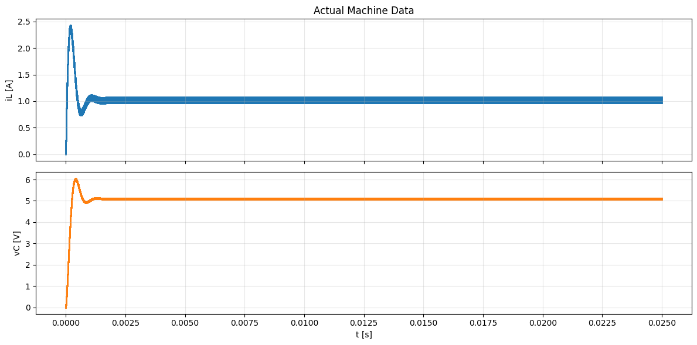
ダウンサンプリング(色がついているところが 6~105 周期目で学習に使うデータ)
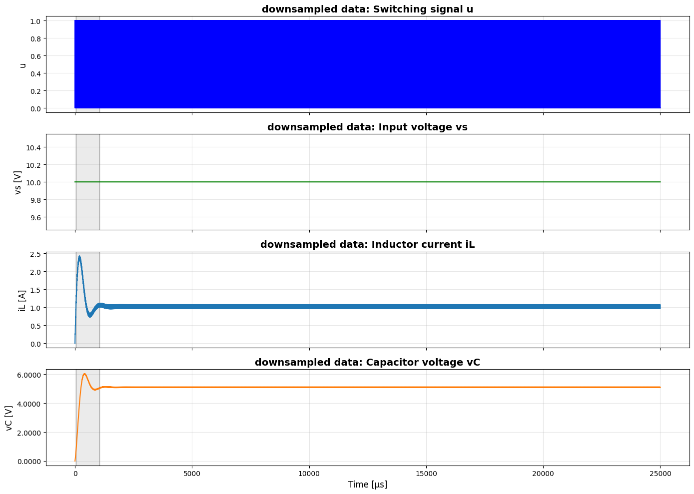
学習データ フィルタリング、6~105 周期目切り出し
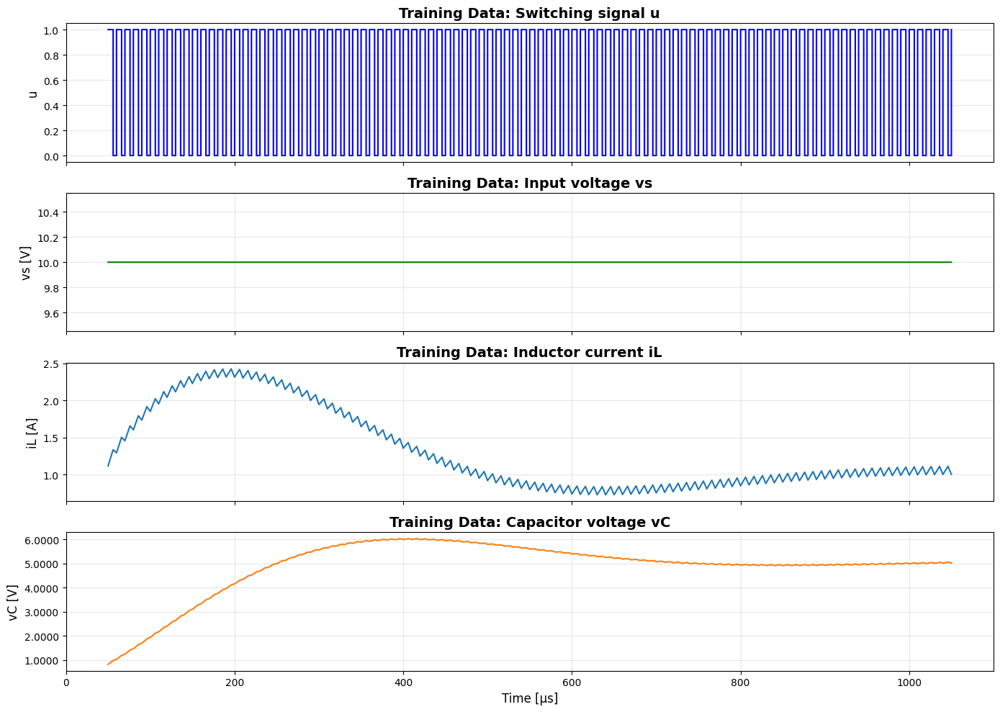

### パラメータ推定結果

|              | インダクタ $L$ | キャパシタ $C$ | 抵抗 $R$ |
| :----------: | :------------: | :------------: | :------: |
|  **真の値**  |   223.6 [μH]   |   72.8 [μF]    | 5.00 [Ω] |
|  **初期値**  |   200.0 [μH]   |   100.0 [μF]   | 8.00 [Ω] |
|  **推論値**  |   231.8 [μH]   |   73.2 [μF]    | 4.76 [Ω] |
| **推定誤差** |    3.65 [%]    |    0.60 [%]    | 4.84 [%] |

### Loss の遷移

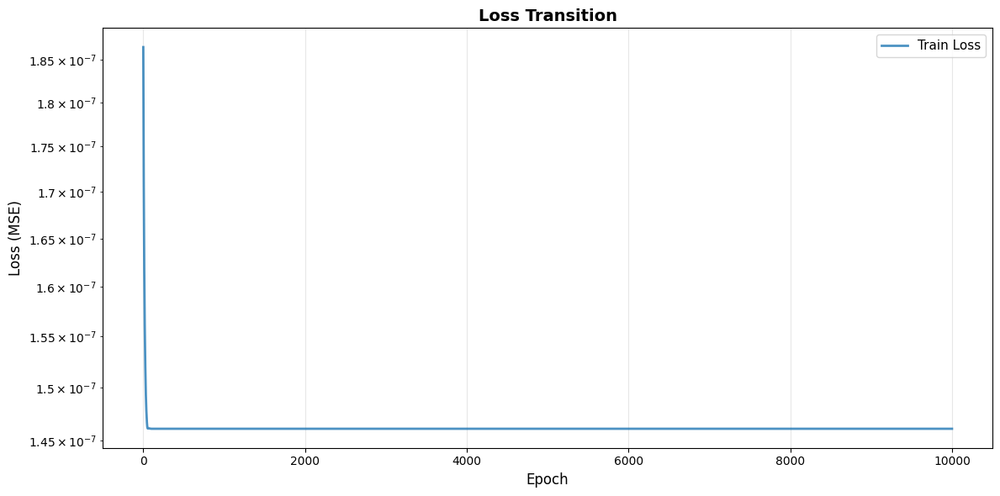

### パラメータ推移（学習過程）

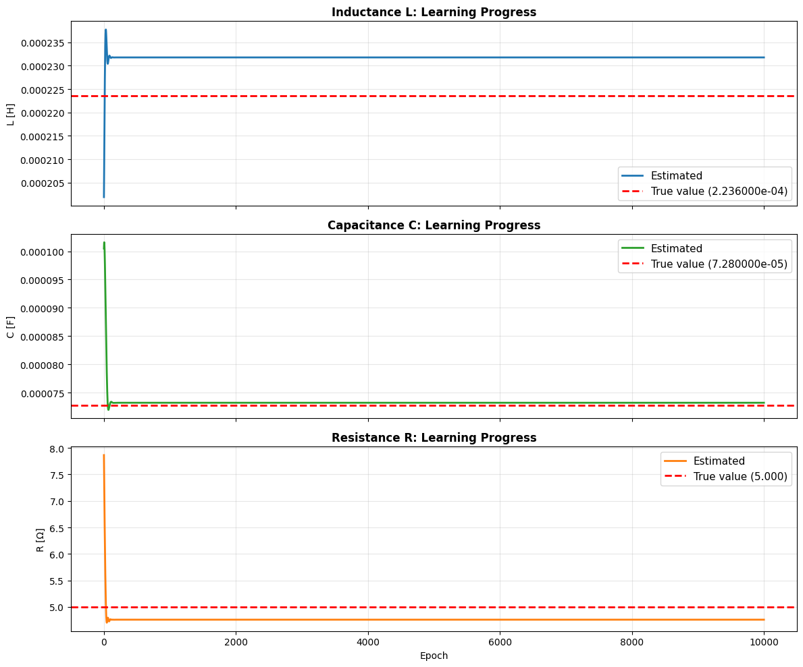

### 学習済みモデルと教師データの比較

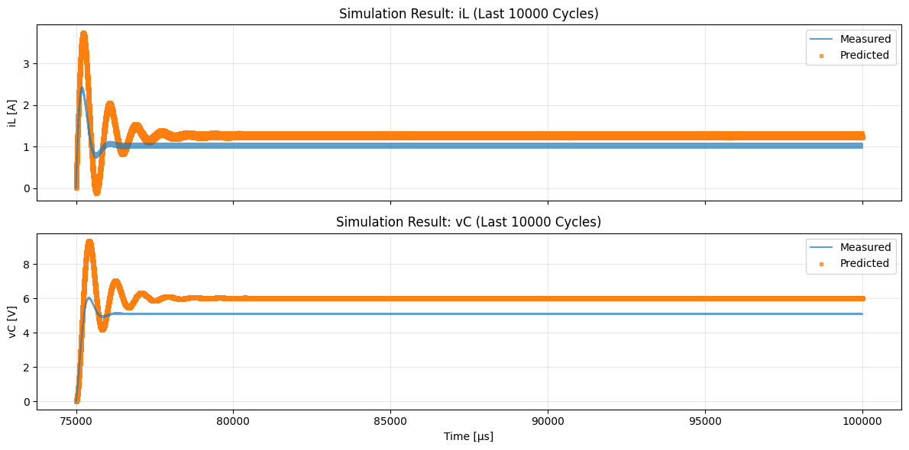
定常部分拡大
.png>)

## GRU のみ 過渡状態のみ

### 学習データ

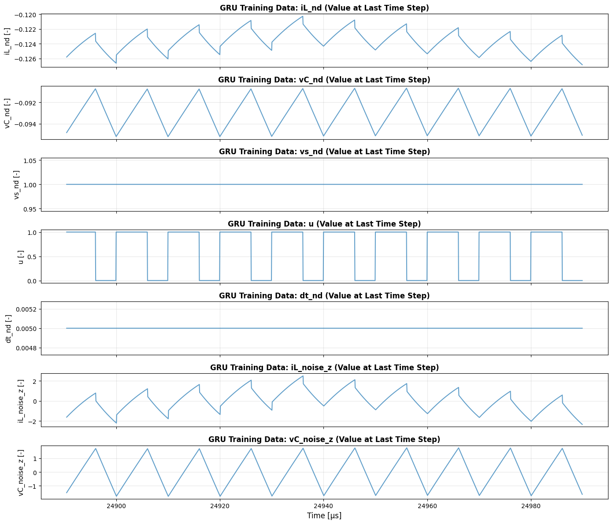

- **無次元化（物理基準）**:
  - iL は `i_base = Vin / R_load` で規格化（例: `iL_nd = iL / (Vin / R_load)`）
  - vC と vs は `v_base = Vin` で規格化（`vC_nd = vC / Vin`, `vs_nd = vs / Vin`）
  - dt は `t_base = T` で規格化（`dt_nd = dt / T`）
  - u は 0/1 なのでそのまま
- **ノイズのみ z-score**: `noise_train` の平均・標準偏差で標準化し、推論後に逆変換して Buck 出力に加算（詳細は [note5/note.ipynb](../../actual_machine_notebooks/note5/note.ipynb) の `Scalers`・`fit_scalers_physics` 参照）

### 結果

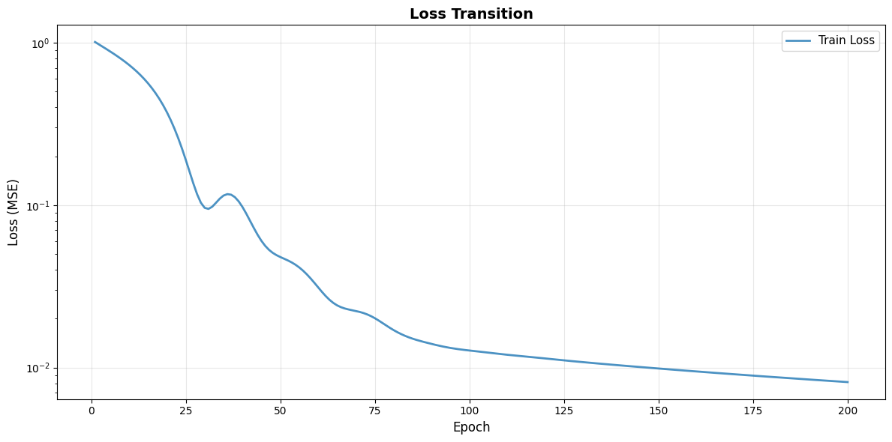

## BuckConverterCell + GRU 推論結果

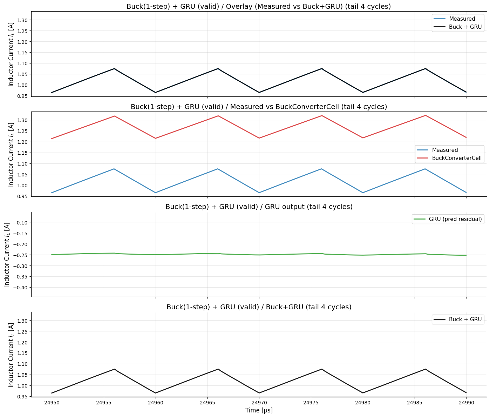
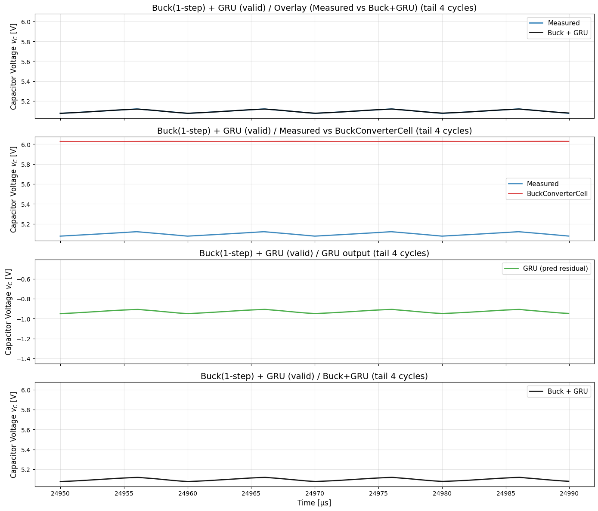

# 実機データ

## RNN のみ 過渡状態のみ

### 使用データ

- **データソース**: 実機データの 6~105 周期の 100 周期分
- **サンプリング数**: 1 周期あたり 200 プロット、約 20000 プロット
- **学習設定**:
  - エポック数 : 10000
  - 学習率:
    - $L$: 5e-2
    - $C$: 1e-2
    - $R$: 2e-2
- **前処理**: シミュレーションと同様（ダウンサンプリング、FIR ローパス平滑化、区間切り出し、1-step 学習用の整列）

### 学習データ

.png>)

### パラメータ推定結果

|              | インダクタ $L$ | キャパシタ $C$ | 抵抗 $R$ |
| :----------: | :------------: | :------------: | :------: |
|  **真の値**  |   223.6 [µH]   |   72.8 [µF]    | 5.00 [Ω] |
|  **初期値**  |   200.0 [µH]   |   100.0 [µF]   | 8.00 [Ω] |
|  **推論値**  |   247.9 [µH]   |   67.6 [µF]    | 4.81 [Ω] |
| **推定誤差** |   10.87 [%]    |    8.42 [%]    | 3.72 [%] |

### パラメータ推移（学習過程）

### 学習済みモデルと教師データの比較

- 不連続が含まれているのに、BuckConverterCell では不連続を考慮していない

## GRU のみ 過渡状態のみ

### 学習データ

- **前処理**: シミュレーションと同様（ノイズ=Buck 予測と実測の残差、物理基準の無次元化、ノイズのみ z-score。詳細は [note5/note.ipynb](../../actual_machine_notebooks/note5/note.ipynb) の `Scalers`・`fit_scalers_physics` 参照）

### 結果

## BuckConverterCell + GRU 推論結果

