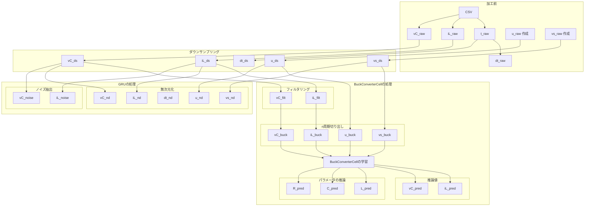

# 進捗報告 ?/?(?)

長崎大学工学部工学科 B4 丸田研究室\
35221011 大塚直哉

---

# フロー

- dt 固定
- 移動平均に修正
- 標準化、無次元化のあることによるメリット

```mermaid

flowchart TB

    subgraph 加工前
        A[CSV]
        t_raw[t_raw]
        dt_raw[dt_raw]
        iL_raw[iL_raw]
        vC_raw[vC_raw]
        u_raw[u_raw 作成]
        vs_raw[vs_raw 作成]
    end

    A --> t_raw
    t_raw --> dt_raw
    A --> iL_raw
    A --> vC_raw


    subgraph ダウンサンプリング
        dt_downsampled[dt_ds]
        iL_downsampled[iL_ds]
        vC_downsampled[vC_ds]
        u_downsampled[u_ds]
        vs_downsampled[vs_ds]
    end

    t_raw --> dt_downsampled
    iL_raw --> iL_downsampled
    vC_raw --> vC_downsampled
    u_raw --> u_downsampled
    vs_raw --> vs_downsampled

    %% ここまで共通処理 %%

    subgraph BuckConverterCellの処理
        subgraph フィルタリング
            iL_filt[iL_filt]
            vC_filt[vC_filt]
        end
        iL_downsampled --> iL_filt
        vC_downsampled --> vC_filt

        subgraph n周期切り出し
            iL_buck[iL_buck]
            vC_buck[vC_buck]
            u_buck[u_buck]
            vs_buck[vs_buck]
        end
        iL_filt --> iL_buck
        vC_filt --> vC_buck
        u_downsampled --> u_buck
        vs_downsampled --> vs_buck

        BuckConverterCell[BuckConverterCellの学習]
        iL_buck --> BuckConverterCell
        vC_buck --> BuckConverterCell
        u_buck --> BuckConverterCell
        vs_buck --> BuckConverterCell

        subgraph 推論値
            iL_pred[iL_pred]
            vC_pred[vC_pred]
        end

        BuckConverterCell --> iL_pred
        BuckConverterCell --> vC_pred

        subgraph パラメータの推論
            L_pred[L_pred]
            C_pred[C_pred]
            R_pred[R_pred]
        end
        BuckConverterCell --> L_pred
        BuckConverterCell --> C_pred
        BuckConverterCell --> R_pred
    end

    subgraph GRUの処理
        subgraph 無次元化
            iL_nd[iL_nd]
            vC_nd[vC_nd]
            dt_nd[dt_nd]
            u_nd[u_nd]
            vs_nd[vs_nd]
        end
        iL_downsampled --> iL_nd
        vC_downsampled --> vC_nd
        u_downsampled --> u_nd
        vs_downsampled --> vs_nd

        subgraph ノイズ抽出
            iL_noise[iL_noise]
            vC_noise[vC_noise]
        end
        iL_downsampled --> iL_noise
        vC_downsampled --> vC_noise
    end


```
