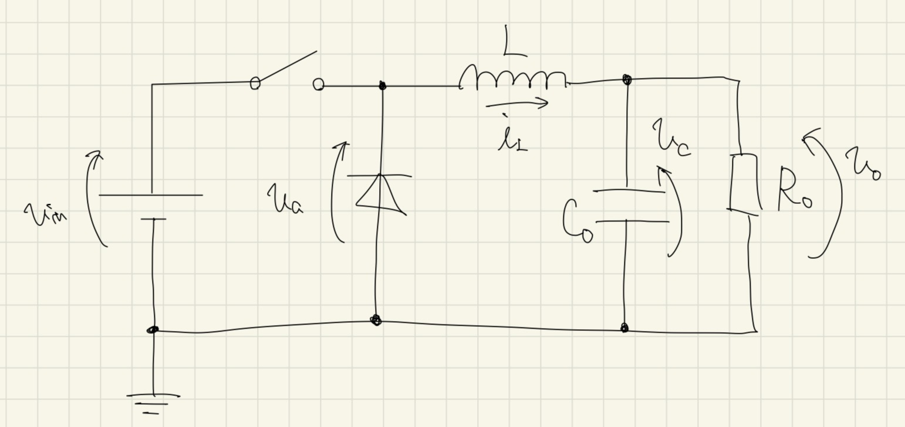
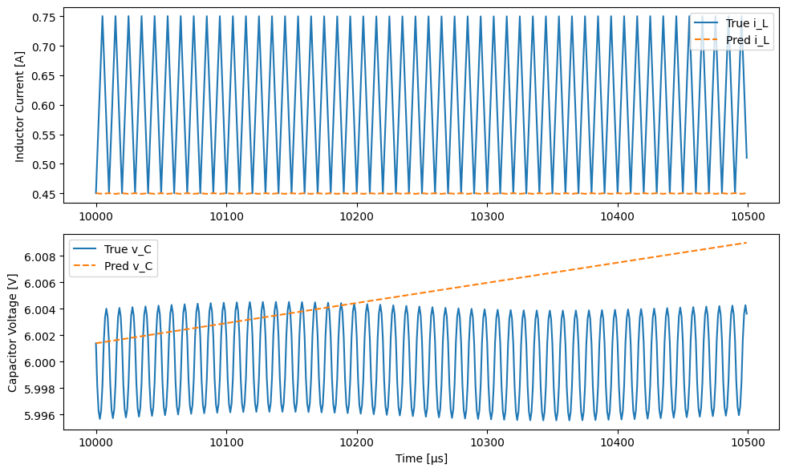
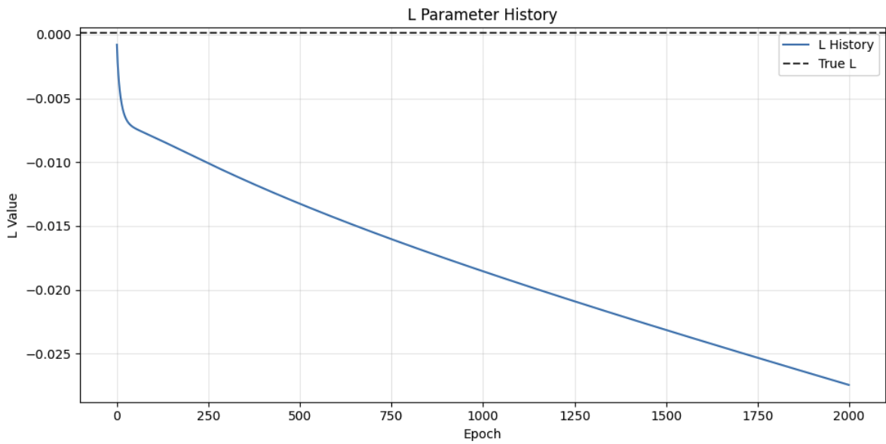
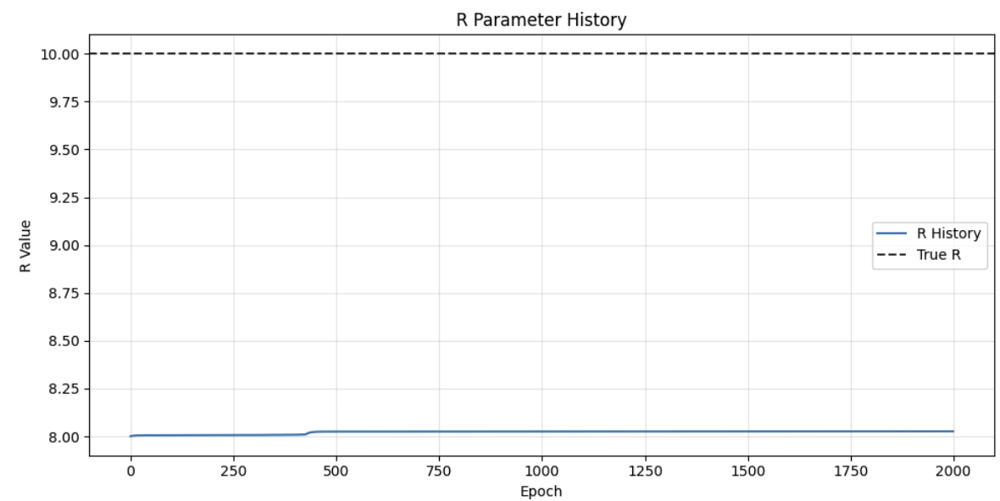
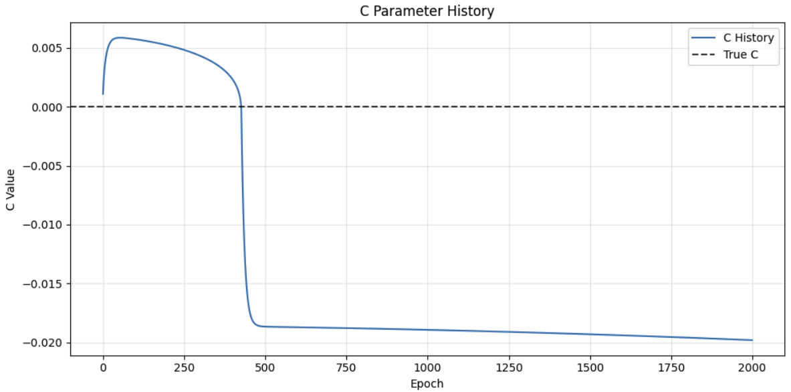
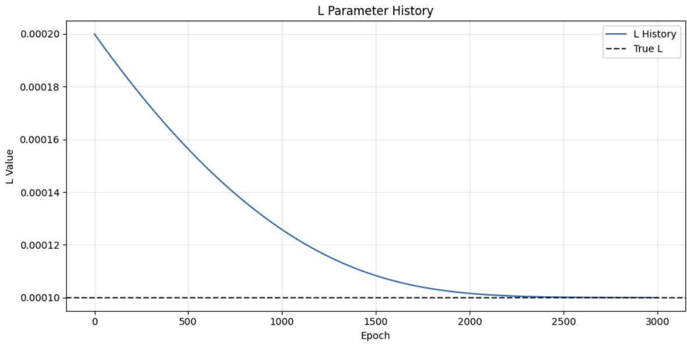
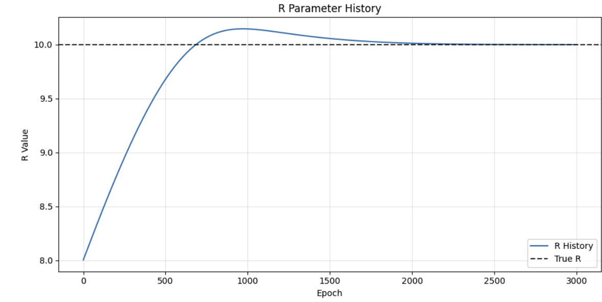
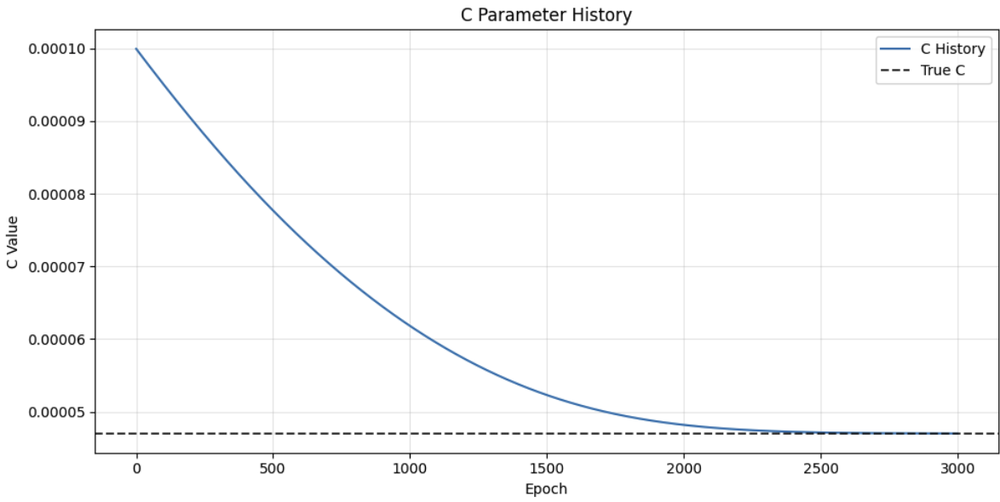

<!-- _class: cover_page -->

# 進捗報告

## 10/27(月)

<br>

長崎大学工学部工学科 B4 丸田研究室
35221011 大塚直哉

---

<!--
# 目次

1. 研究テーマ
2. 研究内容
3. 進捗
4. 課題
5. NA

---

# 研究テーマ: 物理情報を組み込んだリカレントニューラルネットワーク（PANN）によるコンバータの時系列モデリング

従来のデータ駆動型モデルは大量のデータを必要とし、物理的な解釈が難しく、未知の動作条件での予測精度が低いという課題がある。

一方で、物理情報を損失関数に組み込む型（PINN）は、物理的不整合や再学習コストの高さという問題を抱えている。

これらの課題を克服するために、回路の物理法則をニューラルネットワーク構造自体に組み込んだ新しいモデリング手法（PA-RNN）を提案し、少ないデータでも高精度で汎化能力を持つモデルを構築することを目的とする。

---

## 先行研究

論文: [Temporal Modeling for Power Converters With Physics-in-Architecture Recurrent Neural Network](https://msccnagasakiuac-my.sharepoint.com/personal/aa39196433_ms_nagasaki-u_ac_jp/_layouts/15/onedrive.aspx?id=/personal/aa39196433_ms_nagasaki-u_ac_jp/Documents/Microsoft%20Teams%20%E3%83%81%E3%83%A3%E3%83%83%E3%83%88%20%E3%83%95%E3%82%A1%E3%82%A4%E3%83%AB/Li%20et%20al.%20-%202024%20-%20Temporal%20Modeling%20for%20Power%20Converters%20With%20Physics-in-Architecture%20Recurrent%20Neural%20Network.pdf&parent=/personal/aa39196433_ms_nagasaki-u_ac_jp/Documents/Microsoft%20Teams%20%E3%83%81%E3%83%A3%E3%83%83%E3%83%88%20%E3%83%95%E3%82%A1%E3%82%A4%E3%83%AB&ga=1)

ソースコード: https://github.com/XinzeLee/PANN.git

---

# 内容

- PANN のソースコードの実行
- 先行研究では、DAB コンバータでの出力波形の計算、回路パラメータの推定を行っているが、これを Buck コンバータに適用する

--- -->

# 進捗

Buck コンバータの回路図


---

## オイラー法による離散化

$$i_L(t + \Delta t) = i_L(t) + \frac{\Delta t}{L} (v_a - v_o)$$

$$v_C(t + \Delta t) = v_C(t) + \frac{\Delta t}{C_o} \left( i_L - \frac{v_o}{R_o} \right)$$

---

```python
class BuckConverterCell(nn.Module):
    def __init__(
        self,
        dt: float = 1e-6,
        L_init: float = 200e-6,
        C_init: float = 100e-6,
        R_init: float = 8.0,
    ) -> None:
        super().__init__()
        self.dt = dt
        self.L = nn.Parameter(torch.tensor(L_init))
        self.C = nn.Parameter(torch.tensor(C_init))
        self.R = nn.Parameter(torch.tensor(R_init))

    def forward(self, h: torch.Tensor, x: torch.Tensor) -> torch.Tensor:
        i_L, v_C = h[:, 0], h[:, 1]
        v_a = x[:, 0]
        di = (self.dt / self.L) * (v_a - v_C)
        dv = (self.dt / self.C) * (i_L - v_C / self.R)
        i_L_next = i_L + di
        v_C_next = v_C + dv
        return torch.stack([i_L_next, v_C_next], dim=1)
```

---

## シミュレーション波形を作成し、学習させる



---

# 回路パラメータ

```bash
=== Learned Parameters ===
L = -2.745e-02 H
C = -1.981e-02 F
R = 8.027 Ω
```

```bash
=== True Parameters ===
L = 100e-6  # インダクタ [H]
C = 47e-6  # コンデンサ [F]
R = 10.0  # 負荷抵抗 [Ω]
```

---



---



---



---

## 回路パラメータが負の値になってしまうことを防ぐ

```python
class BuckConverterCell(nn.Module):
    def __init__(
        self,
        # 略
    ) -> None:
        super().__init__()
        self.dt = dt
        # パラメータを対数空間で学習（正の値を保証）
        self.log_L = nn.Parameter(torch.log(torch.tensor(L_init)))
        self.log_C = nn.Parameter(torch.log(torch.tensor(C_init)))
        self.log_R = nn.Parameter(torch.log(torch.tensor(R_init)))

    def forward(self, h: torch.Tensor, x: torch.Tensor) -> torch.Tensor:
        i_L, v_C = h[:, 0], h[:, 1]
        v_a = x[:, 0]
        L = torch.exp(self.log_L)
        C = torch.exp(self.log_C)
        R = torch.exp(self.log_R)

        # 略

        return torch.stack([i_L_next, v_C_next], dim=1)
```

---

# 結果(1 つのシミュレーション波形、エポック 3000)

## 

---

## 

---

## 

---

# 課題

### 1. 先行研究のソースコード(DAB コンバータ)では、log 変換から exp 変換を行っていなかったのに、回路パラメータが負になっていなかった。おそらく、Clamper を使用しているから

1.  元の Clamper の範囲: `[(10e-6, 200e-6), (1e-3, 5e0), (0.8, 1.2)]`
2.  広くした Clamper の範囲: `[(-100e-6, 200e-6), (-5, 5), (-1.2, 1.2)]`

Clamper の範囲を広くするだけなら、回路パラメータは負の値にならず、おおよそ正しいパラメータになった
`[6.29e-05, 1.2857785, 0.9992431]`

---

Clamper の範囲を広くするかつ、回路パラメータの初期値を変更したら、回路パラメータが負になってしまうことがあった

回路パラメータの初期値: `RL, Lr, n = 8, 200e-6, 2`
回路パラメータ: `[0.0001165, -1.7660956, 1.2]`

何らかの制約によって、回路パラメータが負になってしまうのを防ぐ必要がある

---

### 2. 先行研究のソースコード(DAB コンバータ)では、Epoch 数が 75 でも損失が 0.012 になっていた

1.  仮説: 学習データが自分のコードだと 1 つだけだが、先行研究のコードでは 12 個あるから
2.  仮説: 学習率が全ての回路パラメータで同じ値にしていたが、先行研究のコードでは、回路パラメータごとに学習率を設定していたから
    1. 各パラメータのオーダーが異なるので、学習率を変える必要がある
3.  仮説: DAB の方が Buck よりも学習が簡単であるから
4.  ~~仮説: 初期値が自分の設定したものより正解値に近かったから~~
    <!-- 1. [7.8e-5, 0.001, 1.0]→[6.29e-5, 1.1945678, 1.0005282]
    1. [200e-6, 100e-6, 8.0]→[100e-6,47e-6, 10.0] -->

---

# NA

1. 先行研究のコードで、Clamper の範囲を広く(負の範囲も含めて)設定して学習させてみる。
   1. どの初期値、どの Clamper の範囲を使ったら、回路パラメータが負にならないかを調べる
2. 先行研究のコードで、回路パラメータの初期値を正解値から遠ざけて学習させてみる。
3. 学習データを増やす
   1. 入力電圧を変えて学習データを増やす
4. 学習率を回路パラメータごとに変えて学習させてみる。
5. GRUやる
