# 進捗報告 11/10(月)

長崎大学工学部工学科 B4 丸田研究室\
35221011 大塚直哉

---

> [ソースコード](https://github.com/University-Laboratory/rnn-pann/tree/main/notebooks)

# エポックを少なくする (note3, note4)

## 学習データを 1 種類から 13 種類に増やした

| 1 種類                                                               | 13 種類                                                                   |
| -------------------------------------------------------------------- | ------------------------------------------------------------------------- |
| 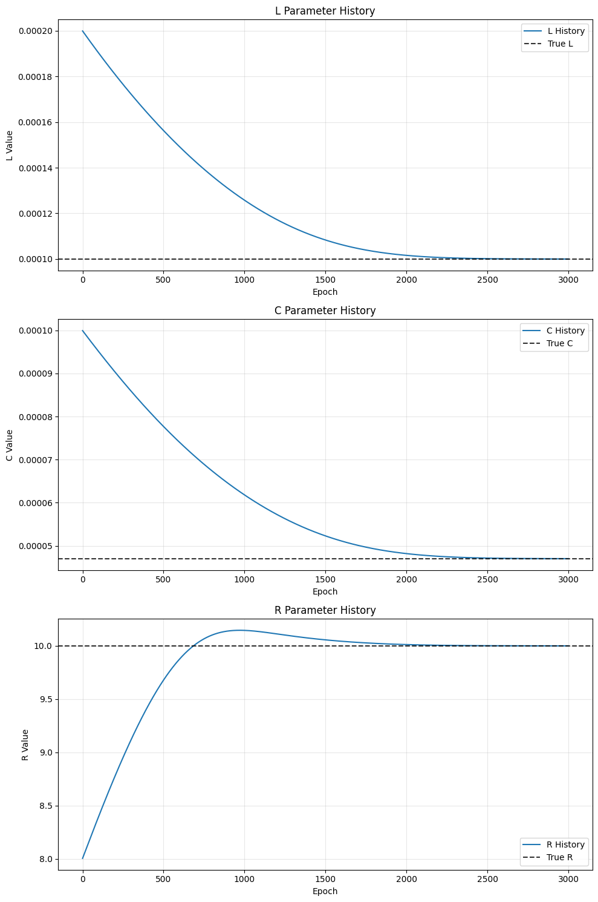 | 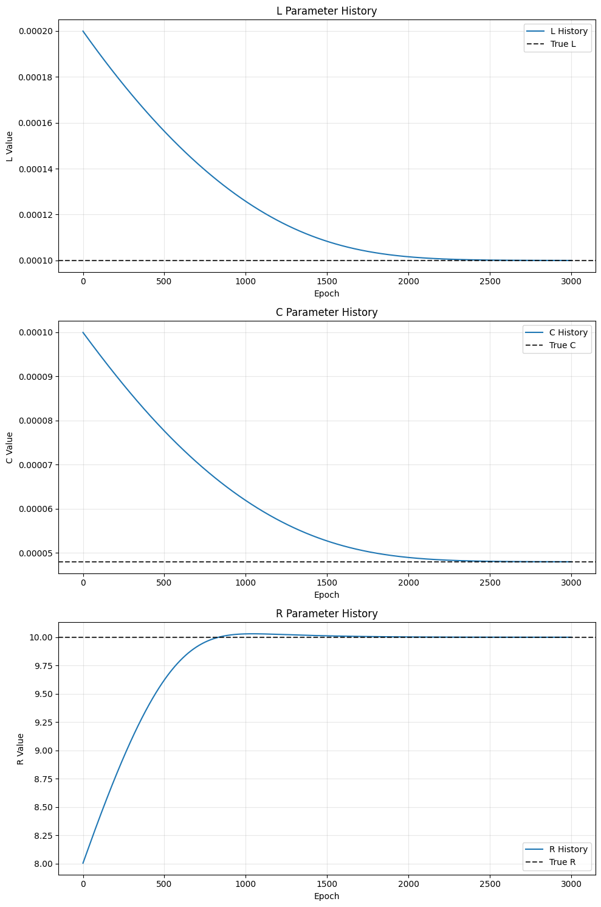 |

### 結果

- 学習データを 13 種類で学習させても、エポック 2500 くらいで収束する
  - 学習データが 1 種類のときは 3000 くらいで収束
  - 1 種類の時よりは若干速くなってるけど、先行研究は 75 だけだから全然多すぎる

## 学習率を回路パラメータごとに変えた

- 前提として、先行研究では回路パラメータをそのまま RNN のパラメータとしていたが、僕のコードは、log をとった値をパラメータとしているので、状況は違う
- 学習率変えたらエポックが少なくてもある程度収束するようになった

```py
L_true = 100e-6
C_true = 48e-6
R_true = 10

L_init = 200e-6
C_init = 100e-6
R_init = 8.0

lr_L = 1e-2
lr_C = 1e-2
lr_R = 2e-2
# 前の学習率は、5e-4 で全てのパラメータ固定

epochs = 200
```

- 決めた学習率は、手動で自分がなんとなく上げていって、なんとなくエポックが少なくても収束するようなものを決めた

### 結果

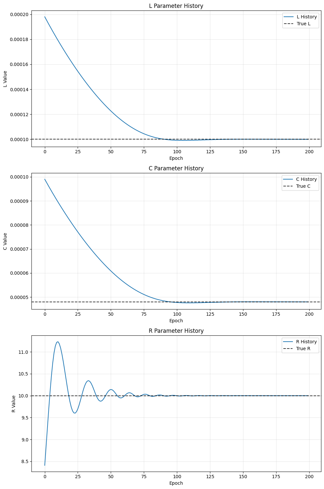

### 考察

- 学習データの種類数がほとんどエポック数に関係がなかったのは、あまり入力電圧が変わらないデータが多かったからかもしれない
- 学習率を上げた方がエポック数が少なくても収束するようになったのは、本来の回路パラメータではなく、log をとった値をパラメータとしているから、値として絶対値が大きくなっていたからだと思う
  - Adam を使っているからエポックを経るごとに学習率が下がっていくので、それも関係しているかもしれないと思う

### まとめ

- 学習データの種類数はほとんどプラスに働かなかったので、一旦 1 種類でやってみる

# vs と u(t)を受け取って実行するようにする (note7)

## やったこと

```python
class BuckConverterCell(nn.Module):
    # 略

    def forward(
        self, h: torch.Tensor, v_s: torch.Tensor, u: torch.Tensor
    ) -> tuple[torch.Tensor, torch.Tensor]:
        # h: [batch, 2] - [i_L, v_C]

        i_L = h[:, 0]
        v_C = h[:, 1]

        v_s_t = torch.as_tensor(v_s, dtype=i_L.dtype, device=i_L.device)
        u_t = torch.as_tensor(u, dtype=i_L.dtype, device=i_L.device)
        v_p = v_s_t * u_t

        # パラメータを指数関数で変換（正の値を保証）
        # 略
```

# 学習データから離れたデータでもシミュレーションできるのか？ (note8)

## やったこと

学習時: v_s = 28

検証時: v_s = 1000

学習時から離れた入力電圧でシミュレーションを行い、オイラー法で作った理想的な出力結果と比べた

### 結果

上手く行った

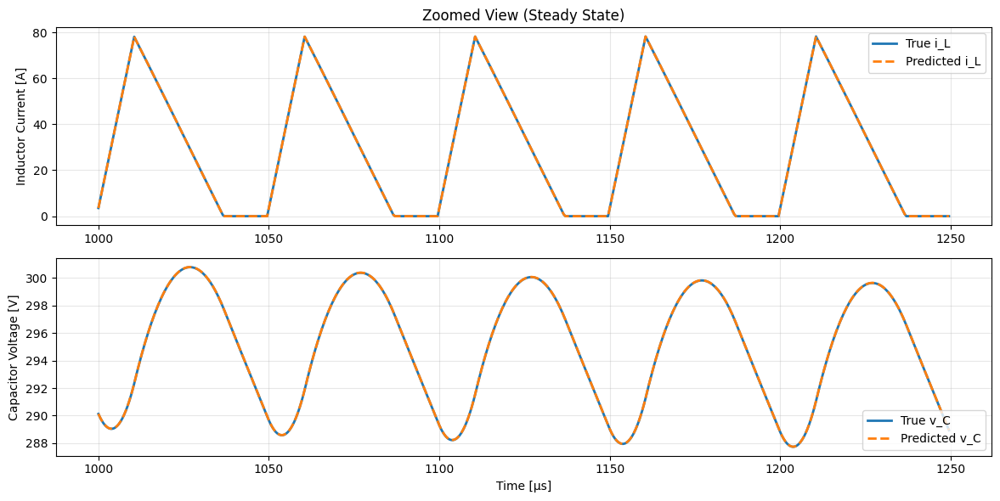

# 定常状態のデータから学習する (note9)

## やったこと

目視で定常状態のデータを選んで学習させた(10 周期分)
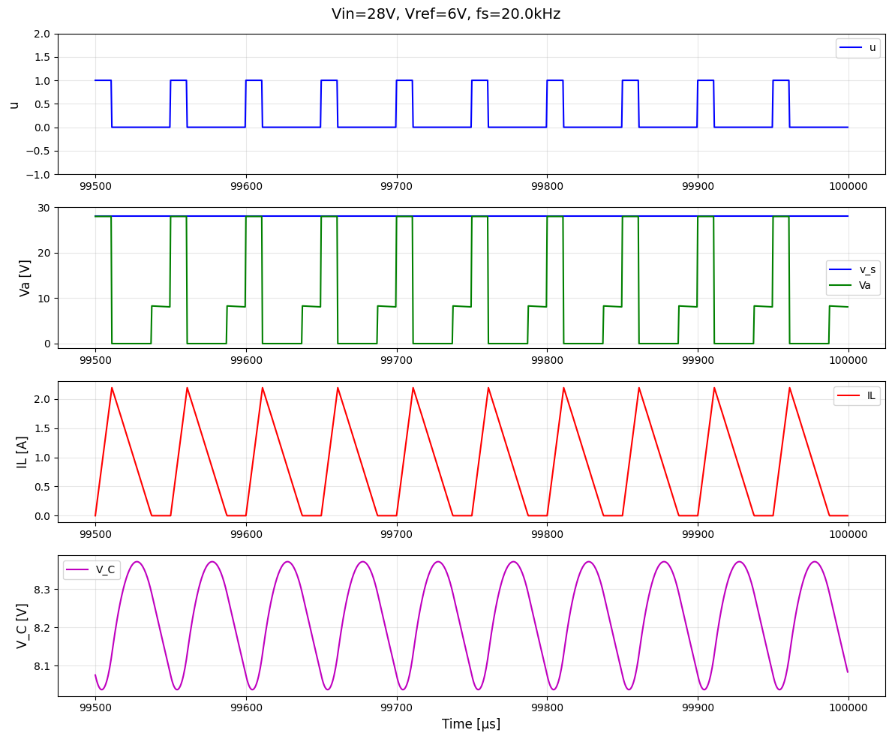

### 結果

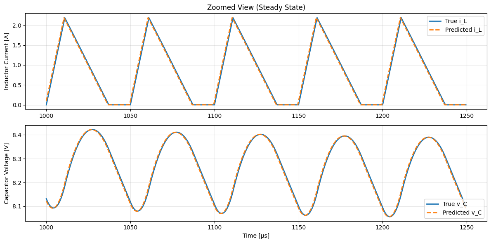

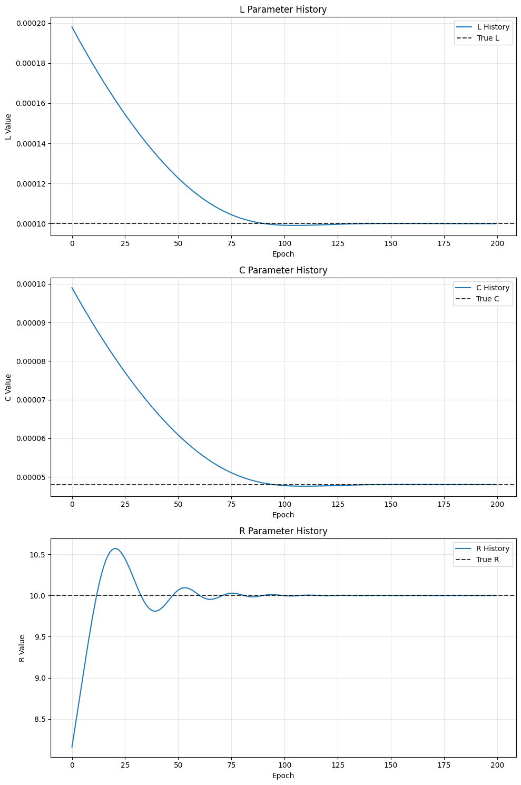

# 軽く GRU 実装してみました (gru-note1)

## GRU (Gated Recurrent Unit)

RNN: ループする経路を持ち、過去の情報を記憶することができる\
問題点: 長期記憶が苦手。BPTT による勾配消失または勾配爆発が発生する\
→ LSTM: ゲート構造で長期記憶を可能に（高精度だが重い）\
→ GRU: LSTM を簡略化して高速化（やや表現力は劣る）。

> 参考: https://qiita.com/nakamin/items/e96542d4e69feb56bc73#2-rnn

## 実装

参考: https://docs.pytorch.org/docs/stable/generated/torch.nn.GRU.html

```python
import torch.nn as nn

gru = nn.GRU(10, 20, 2)
```

## sin 波を学習させる

```python
# ===== データ作成 =====
# sin波を作成
x = np.linspace(0, 100, 1000)
y = np.sin(x)

# シーケンスデータを作成（過去50ステップ→次の1ステップを予測）
seq_length = 50
dataX, dataY = [], []
for i in range(len(y) - seq_length):
    dataX.append(y[i : i + seq_length])
    dataY.append(y[i + seq_length])

dataX = torch.tensor(dataX, dtype=torch.float32).unsqueeze(-1)  # (N, seq_len, 1)
dataY = torch.tensor(dataY, dtype=torch.float32).unsqueeze(-1)  # (N, 1, 1)


# ===== モデル定義 =====
class GRUModel(nn.Module):
    def __init__(
        self,
        input_size: int = 1,
        hidden_size: int = 20,
        num_layers: int = 1,
        output_size: int = 1,
    ) -> None:
        super().__init__()
        self.gru = nn.GRU(input_size, hidden_size, num_layers, batch_first=True)
        self.fc = nn.Linear(hidden_size, output_size)

    def forward(self, x: torch.Tensor) -> torch.Tensor:
        out, _ = self.gru(x)
        out = self.fc(out[:, -1, :])  # 最後の時刻の出力を使用
        return out


model = GRUModel()
loss_fn = nn.MSELoss()
optimizer = optim.Adam(model.parameters(), lr=0.01)

# ===== 学習 =====
epochs = 50
losses = []
for epoch in range(epochs):
    optimizer.zero_grad()
    output = model(dataX)
    loss = loss_fn(output, dataY)
    loss.backward()
    optimizer.step()
    losses.append(loss.item())
    if (epoch + 1) % 10 == 0:
        print(f"Epoch [{epoch + 1}/{epochs}], Loss: {loss.item():.6f}")

# ===== 学習の様子 =====
plt.plot(losses)
plt.axhline(0, color='gray', linestyle='--')
plt.title("Training Loss")
plt.xlabel("Epoch")
plt.ylabel("MSE Loss")
plt.show()

# ===== 予測 =====
with torch.no_grad():
    pred = model(dataX).numpy()

plt.figure()
plt.plot(y[seq_length:], label="True")
plt.plot(pred.squeeze(), label="Predicted")
plt.legend()
plt.title("True vs Predicted")
plt.show()
```

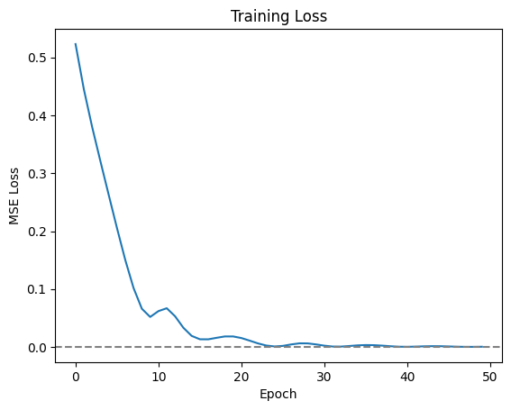
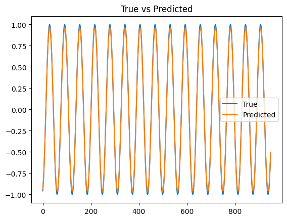

# 実験データで学習する

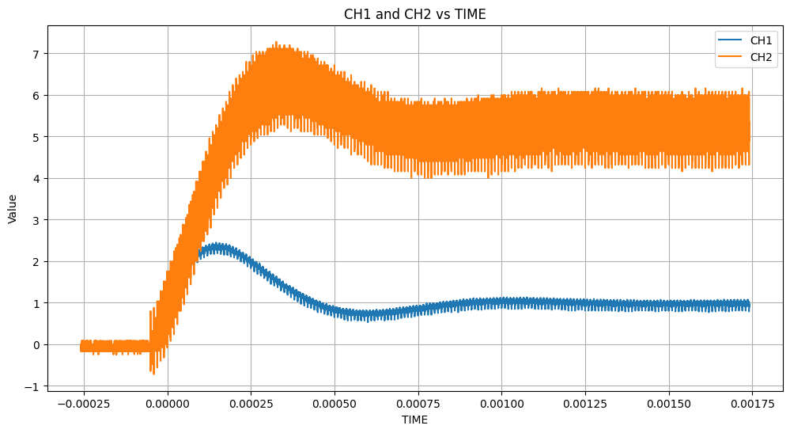
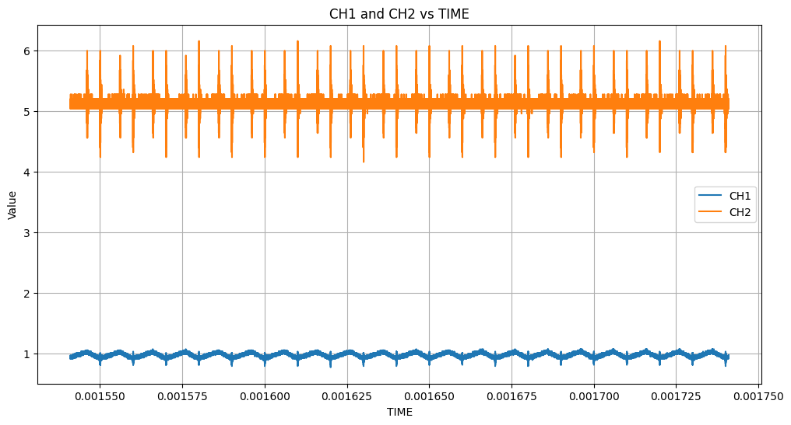

ch1: i_L, ch2: v_C

## やったこと

- 実機データを確認、BuckConverterCell に合わせられるかを検証
- **まずそもそもスイッチング信号、入力電圧が不明なので学習できない**
- TIME 列が等間隔ではないので、dt ごとに計算するアルゴリズムにマッチしていない
  - 大体 2\*10\*\*(-9) [s] くらい
  - `np.float64(1.99999999981465e-09), np.float64(2.0000000000314905e-09)`TIME 列の間隔は、この 2 つのどちらかだった

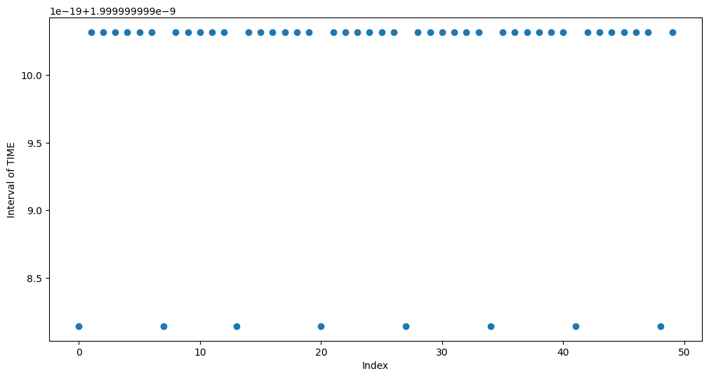

等間隔で間隔がズレてる

... - 5 - 1 - 6 - 1 - 5 - 1 - 6 - 1 - 5 - 1 - ...

試しに ch1 だけ重ねてみたところあまり関係なさそう

→ オシロスコープの仕様？？
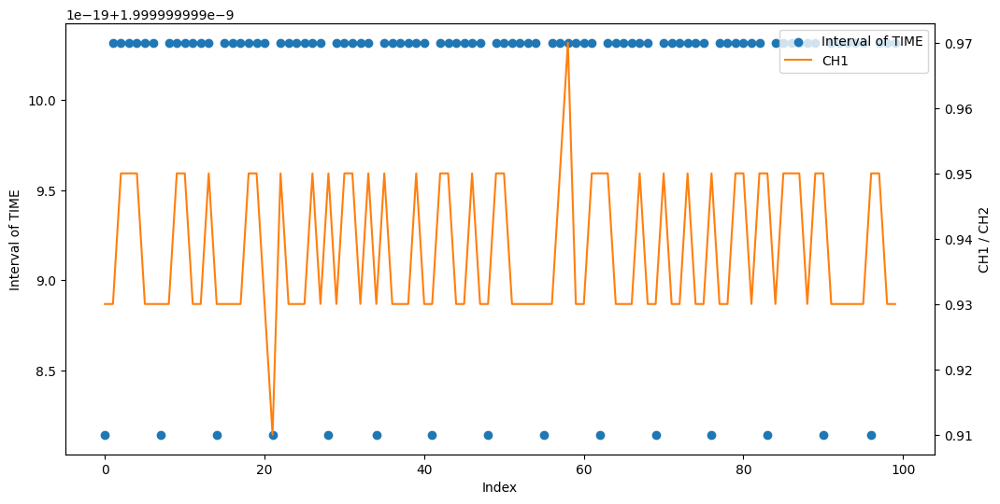

2 つ目のデータ
`np.float64(3.999999997027215e-10), np.float64(4.0000000013640236e-10)`
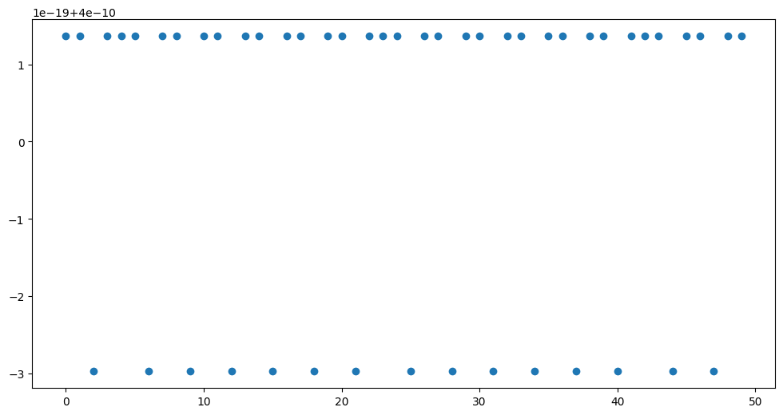

... - 2 - 1 - 3 - 1 - 2 - 1 - 3 - 1 - 2 - 1 - ...

## 調整する方法

- 線形補完する
  - 一致する値がなければ、近い値を 2 点とって直線を引き、その直線上から値を推測する
  - python のライブラリがあったのでそれを使う (scipy)

```python
# 参考: https://qiita.com/shiba54/items/0511d3ba978909590b3d
t = df1["TIME"].to_numpy()
ch1 = df1["CH1"].to_numpy()
ch2 = df1["CH2"].to_numpy()

# 等間隔軸を作る（例：最初〜最後をN点で）
t_uniform = np.linspace(t.min(), t.max(), num=len(t))

# 線形補間関数を作成
f1 = interpolate.interp1d(t, ch1, kind='linear', fill_value="extrapolate")
f2 = interpolate.interp1d(t, ch2, kind='linear', fill_value="extrapolate")

# 等間隔データを生成
ch1_uniform = f1(t_uniform)
ch2_uniform = f2(t_uniform)
```

# NA

- 実機データを使って学習させる
  - GRU も適用してみる

# 先行研究の謎を解明する

先行研究の DAB コンバータのソースコードでは、、、

v_p, v_s はサンプル数 2250、おそらく 9 周期

i_L はサンプル数 251、おそらく 1 周期

## 予想

sync 関数というのがあったので、同期させるために i_L を 9 周期分に複製している
