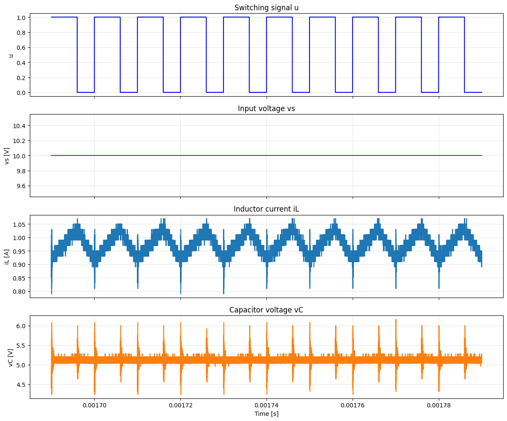

# 現状報告

---

# 現状のモデル

```python
class BuckConverterCell(nn.Module):
    def __init__(
        self,
        L_init: float = 200e-6,
        C_init: float = 100e-6,
        R_init: float = 8.0,
    ) -> None:
        super().__init__()
        # パラメータを対数空間で学習（正の値を保証）
        self.log_L = nn.Parameter(torch.log(torch.tensor(L_init)))
        self.log_C = nn.Parameter(torch.log(torch.tensor(C_init)))
        self.log_R = nn.Parameter(torch.log(torch.tensor(R_init)))

    def forward(
        self,
        h: torch.Tensor,
        vs: torch.Tensor,
        u: torch.Tensor,
        dt: torch.Tensor,
    ) -> tuple[torch.Tensor, torch.Tensor]:
        # h: [batch, 2] - [iL, vC]

        iL = h[:, 0]
        vC = h[:, 1]

        vs_tensor = torch.as_tensor(vs, dtype=iL.dtype, device=iL.device)
        u_tensor = torch.as_tensor(u, dtype=iL.dtype, device=iL.device)
        vp = vs_tensor * u_tensor
        dt_tensor = torch.as_tensor(dt, dtype=iL.dtype, device=iL.device)

        # パラメータを指数関数で変換（正の値を保証）
        L = torch.exp(self.log_L)
        C = torch.exp(self.log_C)
        R = torch.exp(self.log_R)

        # DCM対応
        va = torch.where((vp == 0) & (iL <= 0), vC, vp)

        # オイラー法
        iL_next = iL + (dt_tensor / L) * (va - vC)
        iL_next = torch.relu(iL_next)  # 電流は負にならない（DCM考慮）

        vC_next = vC + (dt_tensor / C) * (iL - vC / R)

        return torch.stack([iL_next, vC_next], dim=1), va

    def get_params(self) -> dict:
        return {
            "L": torch.exp(self.log_L).item(),
            "C": torch.exp(self.log_C).item(),
            "R": torch.exp(self.log_R).item(),
            "log_L": self.log_L.item(),
            "log_C": self.log_C.item(),
            "log_R": self.log_R.item(),
        }
```

学習に使ってる計算部分

```python
iL_next = iL + (dt_tensor / L) * (va - vC)
iL_next = torch.relu(iL_next)  # 電流は負にならない（DCM考慮）

vC_next = vC + (dt_tensor / C) * (iL - vC / R)
```

# 学習に必要なもの

- 入力電圧 vs
- スイッチング信号 u
- 出力電圧 vC
- 出力電流 iL



これで、モデル内のパラメータ(log_L, log_C, log_R)を学習できる

学習済みモデルでシミュレーションを行いたい場合
(学習はせずにシミュレーションだけ行いたい場合)

モデル内の log_L, log_C, log_R を指数関数で変換して L, C, R を求め、以下の式でシミュレーションを行うだけ

$$i_L(t + \Delta t) = i_L(t) + \frac{\Delta t}{L} (V_{in} * u(t) - v_c)$$

$$v_C(t + \Delta t) = v_C(t) + \frac{\Delta t}{C} \left( i_L - \frac{v_C}{R} \right)$$

なので必要なのは、L, C, R, vs, u (iL, vC は初期値だけ必要だけど両方 0 )

# 現状課題

- 実機データで学習がうまくいっていない
  - 学習中に C の値が小さくなりすぎて、シミュレーションでは vC が爆発的に大きくなってしまう
- GRU は単体では sin カーブを学習できることは確認済み

# 次やること

- 10 周期分で学習する
- 余裕があれば layer ごとに実装する
