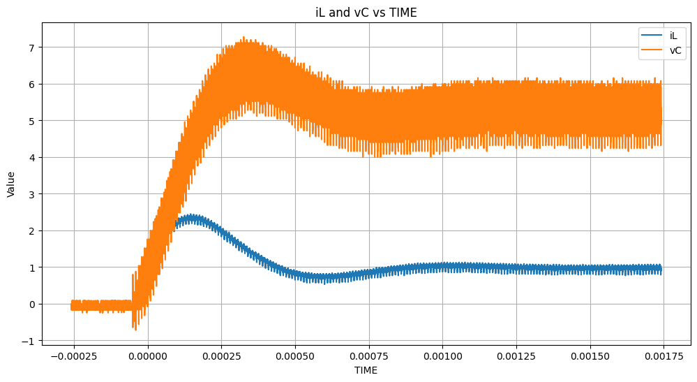
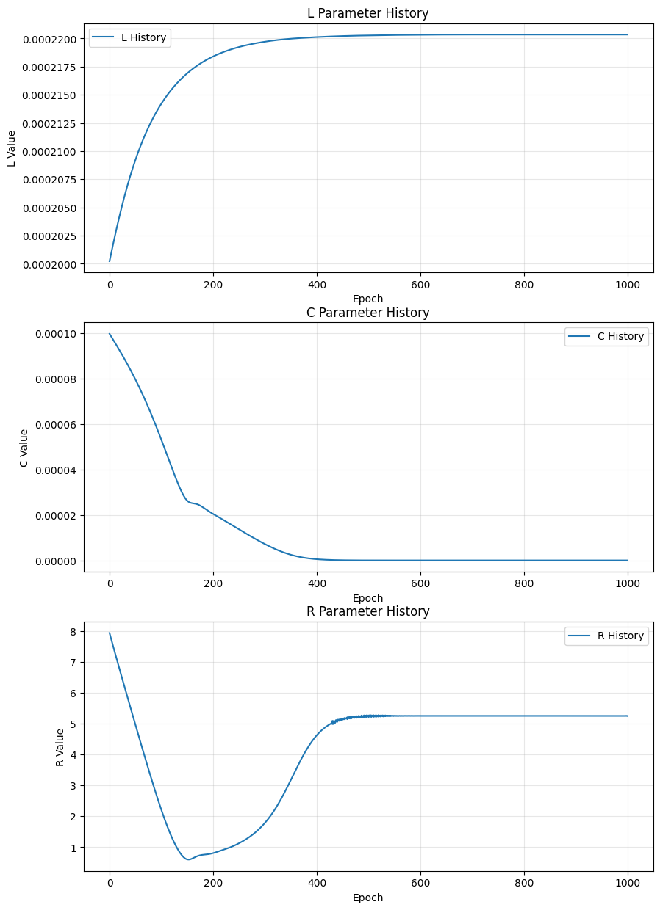

# 進捗報告 ?/?(?)

長崎大学工学部工学科 B4 丸田研究室\
35221011 大塚直哉

---

# 実機のデータを使って回路パラメータを推論できるか

## やったこと

実機データ



10 周期だけ学習に使う


```python
Vin = 10
Vref = 6
duty = Vref / Vin
f_sw = 1e5  # スイッチング周波数
T = 1 / f_sw  # 1周期の実時間
```

Duty 比を 0.6 に、スイッチング周期を 10us に設定

スイッチング信号

.png>)

### 結果

※詳しくは [note13](../../notebooks/note13.ipynb) を参照



L は収束してなさそうに見える

### 問題点

学習済みモデルを使い、学習と同じ vs, u, dt を使ってシミュレーションした結果

出力に NaN が多く含まれてた

おそらく、推論したときの C の値が小さすぎて(6.3e-9 ぐらい)、vC の更新の時に爆発的に大きくなって inf → nan になった

```python
t_sim のNaNの個数: 0
u_sim のNaNの個数: 0
va_sim のNaNの個数: 0
vs_sim のNaNの個数: 0
iL_sim のNaNの個数: 35552
vC_sim のNaNの個数: 35552
```

### 疑問

実機データの vC
.png>)

シミュレーション波形の vC(note12.ipynb)
.png>)

この 2 つが同じ vC とは思えない実機ではなんらかの方法で補正しているのか？

そもそもこの実機データは正しいのか？同じ回路なのか？

### 仮説

- 10 周期が少なすぎる
- 1 周期あたり 5000 プロットあるのが多すぎる？シミュレーションデータの時は 200 プロット程度
- ノイズの影響で正しい C の値が推論できていない
  - [note12](../../notebooks/note12.ipynb)でノイズありの場合の C の値が本来の値よりも小さくなっている
  - `C=46.0µF (true=48.0)`

# 回路パラメータの初期値の決定方法

## ざっくり解析的に各パラメータを決める

### オイラー法の式

$$i_L(t + \Delta t) = i_L(t) + \frac{\Delta t}{L} (V_{in} * u(t) - v_c)$$

$$v_C(t + \Delta t) = v_C(t) + \frac{\Delta t}{C} \left( i_L - \frac{v_C}{R} \right)$$

### R

定常状態では、以下の近似が成り立つと仮定

$$
i_L(t+\Delta t) \approx i_L(t)
$$

$$
v_C(t+\Delta t) \approx v_C(t)
$$

オイラー法の式に代入

> $$v_C(t + \Delta t) = v_C(t) + \frac{\Delta t}{C} \left( i_L - \frac{v_C}{R} \right)$$

$$
0 = \frac{\Delta t}{C}\left(i_L - \frac{v_C}{R}\right)
$$

$$
R \approx \frac{v_C}{i_L}
$$

### L

> $$i_L(t+\Delta t) = i_L(t) + \frac{\Delta t}{L} (V_{in}u(t)-v_C(t))$$

$$
\Delta i_L = i_L(t+\Delta t)-i_L(t)
$$

$$
x = \Delta t (V_{in}u(t)-v_C(t))
$$

とおいたとき、

$$
\Delta i_L = \frac{1}{L} \cdot x
$$

となるので、これを最小二乗法で解くと、

$$
\frac{1}{L} = \frac{\sum \Delta i_L \cdot x}{\sum x^2}
$$

### C

> $$v_C(t+\Delta t) = v_C(t) + \frac{\Delta t}{C}\left(i_L(t)-\frac{v_C(t)}{R}\right)$$

$$
\Delta v_C = v_C(t+\Delta t) - v_C(t)
$$

$$
z = \Delta t\left(i_L - \frac{v_C}{R_0}\right)
$$

とおいたとき、これを最小二乗法で解くと、

$$
\Delta v_C = \frac{1}{C} z
$$

$$
\frac{1}{C} = \frac{\sum \Delta v_C \cdot z}{\sum z^2}
$$

### 結果

大体いい感じに求まる(要検証)

# NA

- GRU 早めにやる
- ホイン法でモデリングする
- プッシュプルコンバータもやる
- プロット数多すぎてノイズに大きく影響されてる可能性がある
- LCRの値を違う波形を学習させるとどうなるか？
  - 結局推論した回路パラメータを使ってシミュレーション波形を作成してるだけだから
