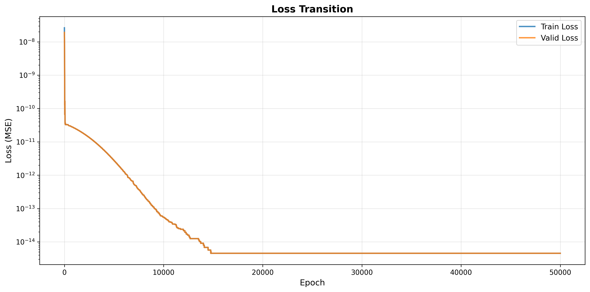
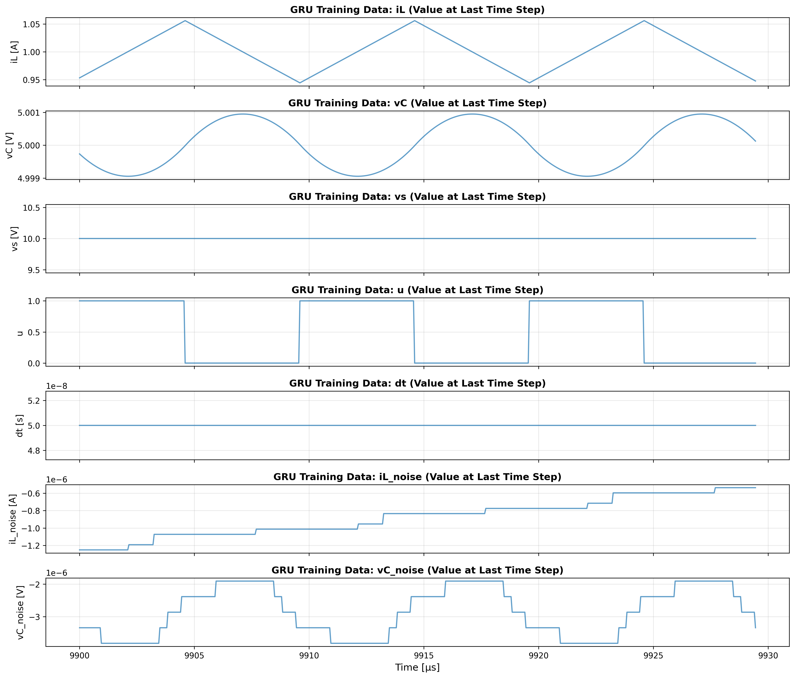

# actual_machine_notebooks/note3/note_sim.ipynb 実行ログ

[詳細](../../actual_machine_notebooks/note3/note_sim.ipynb)

実行日時: 2025-12-20 16:32:51

---

# シミュレーションして学習データ作成

## BuckConverterCell の学習結果: Loss の遷移

## 回路パラメータの学習による変化

エポックを 1000 でやっていたが、C が収束しづらかったので 50000 に増やした

## シミュレーション結果

ほぼほぼ一致

## GRU 学習データ

iL_noise, vC_noise は 10^-6 オーダーで、一応ちょっとだけズレてる

## GRU Loss の遷移

## GRU noise 予測(テスト, tail10T)

意味不明な予測結果になっている

iLの方は、まだ誤差と言える範囲な気がするが、vCの方は、BuckConverterCellの予測結果を明らかに変えてしまうほどの出力になってる
## iL: Measured / Buck / GRU / Buck+GRU（末尾 4 周期）

## vC: Measured / Buck / GRU / Buck+GRU（末尾 4 周期）

