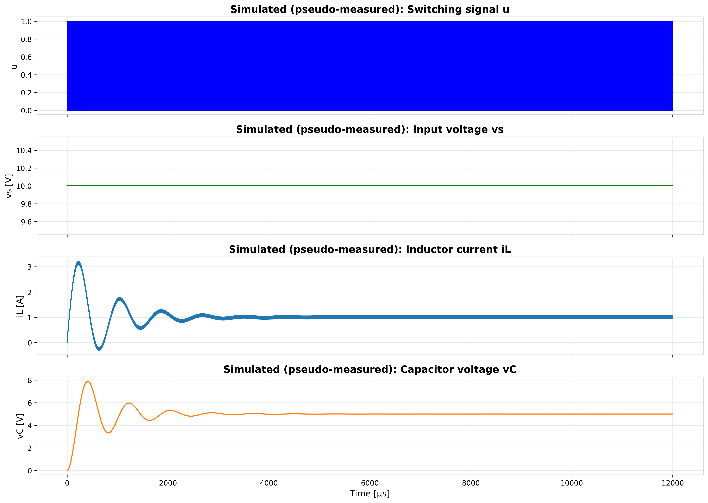
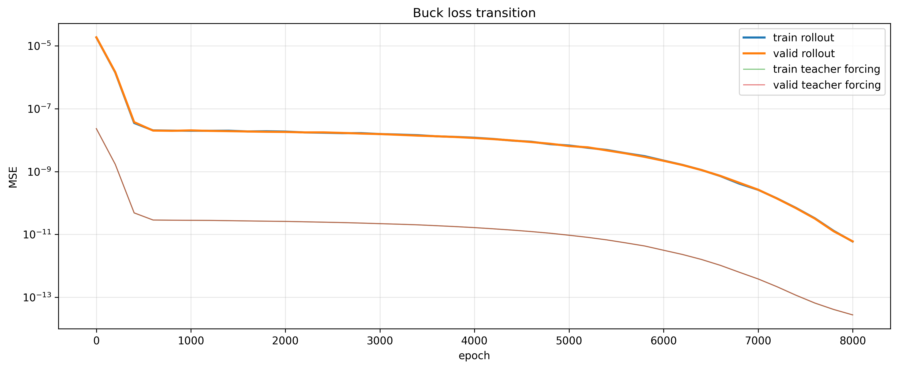
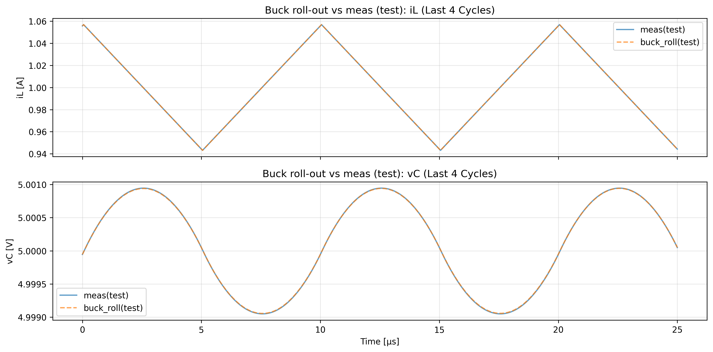

# actual_machine_notebooks/note4/note_sim.ipynb 実行ログ（教授報告用）

実行日時: 2025-12-22 15:16:54

## 目的（この実行で確認したいこと）

- **物理モデル（BuckConverterCell）** で回路パラメータ \(L, C, R\) を推定できるか（rollout 学習）
- 物理モデルの誤差（残差）を **GRU で予測して補正**し、**Buck + GRU** で波形再現精度が上がるか

## 実験条件（主要パラメータ）

```
C_init: 0.0001
C_true: 7.5e-05
L_init: 0.0002
L_true: 0.00022
R_init: 8.0
R_true: 5.0
Vin: 10.0
Vref: 5.0
duty: 0.5
f_sw: 100000.0
T: 1e-05
cycles: 1200
samples_per_cycle: 200
train_cycles: 10
train_ratio: 0.5
valid_ratio: 0.25
win_len: 50
batch_size: 256
grad_clip_norm: 5.0
lr_l: 0.005
lr_c: 0.001
lr_r: 0.002
epochs_buck: 8000
seq_length: 10
gru_lr: 0.001
epochs_gru: 300
noise_std_iL: 0.02
noise_std_vC: 0.02
```

- **時間刻み**: 1 周期 \(T\) を `samples_per_cycle` 分割（\(dt \approx T/200\)）
- **学習データ**: 1200 周期シミュレーション後、末尾 `train_cycles=10` 周期だけを使用（**2000 steps**）
- **分割方法**: 時系列で連続分割（**train=1000 / valid=500 / test=500** steps）

## 注意点（結果の解釈に重要）

- 本ノートブック（Cell 4）では疑似「計測」ノイズ付加がコメントアウトされており、**疑似計測 = 真値（ノイズ無し）**になっている
  - `noise_std_*` は「将来ノイズを入れるための設定」で、**今回の波形生成には未使用**
  - そのため MSE が非常に小さい（ほぼ完全一致）条件での検証

## データ生成（シミュレーション波形）



- 真値パラメータ \(L*{\mathrm{true}}, C*{\mathrm{true}}, R\_{\mathrm{true}}\) の BuckConverterCell で状態 \(h = [i_L, v_C]\) を生成
- 入力 \(x = [v_s, u, dt]\)
  - \(v*s(t) = V*{\mathrm{in}}\) 一定, \(u(t)\) は duty によるスイッチング

## 学習データ（末尾 10 周期のみ使用）


- 長時間シミュレーションで定常化し、末尾データのみで学習（トランジェント影響を避ける）

## Buck（物理モデル）: rollout 学習によるパラメータ推定

- **学習のポイント:**
  - 連続系列から window を切り出し（`win_len=50`）、**teacher forcing ではなく rollout で先読み**した系列と教師系列の MSE を最小化
  - 損失の図には teacher forcing MSE も併記（**監視用**、主目的は rollout MSE）

### 推定パラメータ（最終値）

```
L_hat=2.200003e-04
C_hat=7.543847e-05
R_hat=5.000073e+00
```

### Buck 損失遷移（rollout / teacher forcing）



### Buck パラメータ推定の推移


- \(L, R\) は早期に真値近傍へ収束
- \(C\) は相対的に収束が遅いが最終値は真値近傍（上記 `C_hat` 参照）

### Buck rollout の波形比較（末尾 4 周期）




- test 区間でも波形は高精度で一致（ノイズ無し条件のため差は非常に小さい）

## GRU: 残差（meas - buck_rollout）の予測（z-score）

- **残差の定義**: `noise = meas - buck_rollout`（steps 系列で定義）
- **無次元化（scale）**:
  - \(i_L\) は `I_base`（train 区間の \(|i_L|\)平均）で割る
  - \(v_C\) は `Vref` で割る
  - \(v_s\) は `Vin` で割る
  - \(dt\) は `dt*f_sw` として無次元化（概ね \(dt/T\)）
- **z-score 標準化**:
  - `noise_scaled` を **train 区間のみ**で平均・標準偏差を計算し、`noise_z = (noise_scaled - mean) / std`
- **GRU 入力（7 次元）**:
  - \([i_L, v_C, v_s, u, dt, iL\_noise_{prev}(z), vC\_noise_{prev}(z)]\)
- **GRU 出力（2 次元）**: 次時刻の `noise_z = [iL_noise_z, vC_noise_z]`

### GRU noise z-score 統計（train）

```
[GRU noise z-score stats]
noise_mean_scaled = [ 1.4246302e-07 -6.2894821e-07]
noise_std_scaled  = [1.1530162e-07 8.1618151e-07]
noise_train_z_mean = [2.2554397e-07 1.9311905e-08]
noise_train_z_std  = [1. 1.]
```

- `noise_mean_scaled`, `noise_std_scaled` は無次元化後（scaled 空間）の残差統計
- `noise_train_z_std = [1, 1]` となっており、z-score が意図通り機能

### GRU 学習データ（特徴量の時系列, z-score）


### GRU 損失遷移（MSE, z-score 空間）


### GRU 評価（test, z-score 空間の MSE）

```
GRU test loss = 3.001070e-01
```

## Buck + GRU 合成（test）

- **合成方法**:
  - GRU の出力は`noise_z`なので、`z-score -> scaled -> 物理単位`に復元
  - その残差を Buck rollout に足して`Buck+GRU`を構成
- **評価区間**:
  - GRU は`seq_length=10`の履歴信号が必要なため、test 区間の先頭 10 steps を除いた区間で比較

### iL: Measured / Buck / GRU / Buck+GRU（末尾 4 周期）


### vC: Measured / Buck / GRU / Buck+GRU（末尾 4 周期）


## 数値評価（test, 物理単位での MSE）

```
MSE(all)      buck     = 8.811593e-12
MSE(all)      buck+gru = 7.600088e-13
MSE(iL)       buck     = 3.142339e-14
MSE(iL)       buck+gru = 6.822660e-15
MSE(vC)       buck     = 1.759176e-11
MSE(vC)       buck+gru = 1.513195e-12
```

- **all** は \([i_L, v_C]\) をまとめた平均（二乗誤差の平均）
- **vC の寄与が支配的**（`MSE(vC)` が大きい）で、Buck+GRU で vC 側の MSE が大きく低下

## Summary（結論・要点）

```
【回路パラメータ】
  真の値:  L = 2.200000e-04 [H], C = 7.500000e-05 [F], R = 5.000 [Ω]
  初期値:  L = 2.000000e-04 [H], C = 1.000000e-04 [F], R = 8.000 [Ω]
  推論値:  L = 2.200003e-04 [H], C = 7.543847e-05 [F], R = 5.000 [Ω]
```

- **Buck rollout 学習で \(L,C,R\) は真値近傍に推定**（ノイズ無し条件）
- **Buck 単体でも MSE は極小**, **Buck+GRU でさらに MSE が低下**
- 今後は、疑似計測ノイズを付加した条件（`noise_series`有効化）で同様に評価し GRU が「ノイズ成分」をどこまで補償できるかを確認
