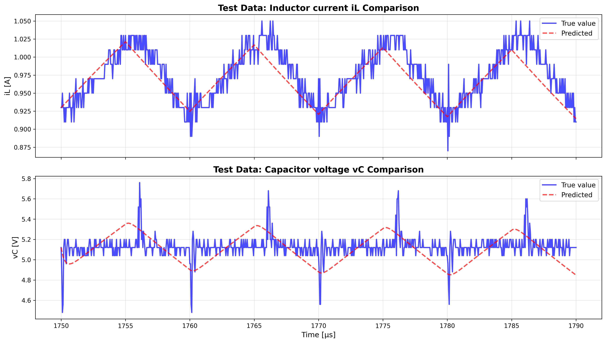
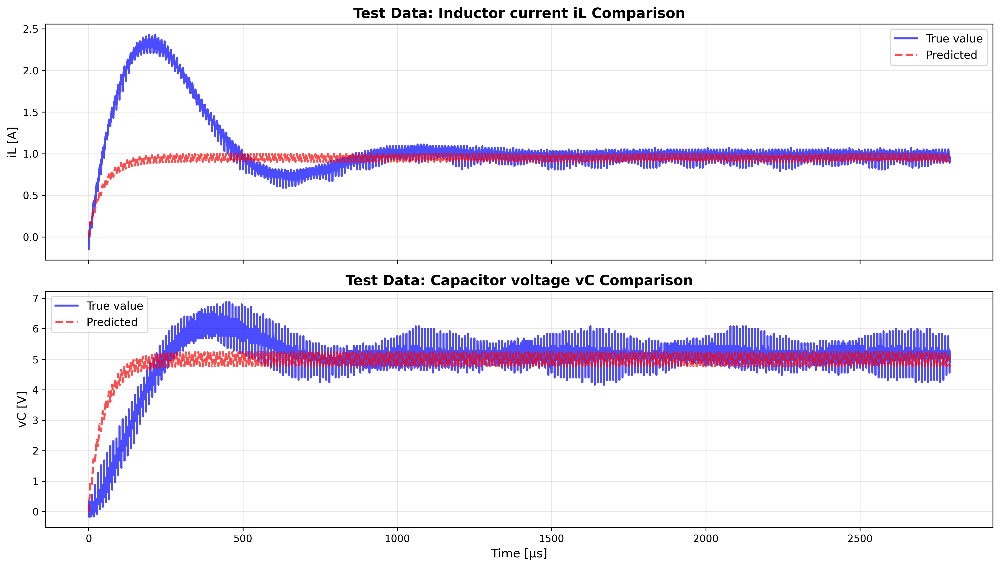

# 進捗報告 12/8(月)

長崎大学工学部工学科 B4 丸田研究室\
35221011 大塚直哉

---

# 目的

BuckConverterCell と GRU を組み合わせて、実機データをシミュレーションした結果と比較する

[詳細は actual_machine_notebooks/note1/note1.ipynb を参照](../../actual_machine_notebooks/note1/note1.ipynb)

## やったこと

- GRU モデルの実装

```python
# GRUモデルの定義（ノイズ予測用）
class GRUModel(nn.Module):
    def __init__(
        self,
        input_size: int = 7,  # [iL, vC, vs, u, dt, iL_noise, vC_noise]
        hidden_size: int = 32,
        num_layers: int = 2,
        output_size: int = 2,  # [iL_noise, vC_noise]
        seq_length: int = 10,  # 時系列の長さ
    ) -> None:
        super().__init__()
        self.seq_length = seq_length
        self.gru = nn.GRU(input_size, hidden_size, num_layers, batch_first=True)
        self.fc = nn.Linear(hidden_size, output_size)

    def forward(self, x: torch.Tensor) -> torch.Tensor:
        """
        x: [batch_size, seq_length, input_size]
        出力: [batch_size, output_size]
        """
        out, _ = self.gru(x)
        out = self.fc(out[:, -1, :])  # 最後の時刻の出力を使用
        return out
```

## 流れ

1. 実機データの末尾から 10 周期分を学習データとして切り出す
2. train, valid, test を 3:3:4 に分割
3. BuckConverterCell のみで train データを使って学習を行う
4. GRU で学習する\
   ┗`[実機データ] - [学習済みのBuckConverterCellでのシミュレーションデータ]` を教師として学習
5. 学習済みの BuckConverterCell と GRU を組み合わせて、test データをシミュレーションしてみる
6. 実機データと比較する

※ 真の回路パラメータは劣化等により変わっている可能性あり

```
=== Buck Converter Cell ===

【回路パラメータ】
  真の値: L = 2.236000e-04 [H], C = 7.380000e-05 [F], R = 5.000 [Ω]
  初期値: L = 2.000000e-04 [H], C = 1.000000e-04 [F], R = 8.000 [Ω]
  推論値: L = 2.668910e-04 [H], C = 6.074582e-08 [F], R = 5.267 [Ω]

【入力条件】
  Vin (入力電圧) = 10.00 [V], Vref (目標電圧) = 5.00 [V]
  スイッチング周波数 f_sw = 100000 [Hz]
  1周期あたりのプロット数 = 200

【データ分割】
  シミュレーション時間: 10周期 = 100.0μs
  学習データ: 600 ステップ
  検証データ: 600 ステップ
  テストデータ: 801 ステップ

【最終Loss】
  学習データ: 6.635946e-03
  検証データ: 6.009466e-03
  テストデータ: 5.414776e-03

【学習設定】
  エポック数: 1000
  学習率: L = 5.00e-02, C = 1.00e-02, R = 2.00e-02
=== GRU ===
  エポック数: 200
  学習率: 1.00e-03
```

### 真の回路シミュレーション & 実測値比較

- 真の回路パラメータを元にシミュレーション


.png>)

- 実機データだけ見てたら定常っぽかったが、シミュレーションを見ると定常っぽくない

### 学習データ

- 実機データの末尾から 10 周期分を学習データとして切り出す
- train, valid, test を 3:3:4 に分割


### Loss の遷移

- まずは BuckConverterCell のみで学習を行う


### 回路パラメータの学習による変化


- L は真の値より 20uF くらい大きい
- C は真の値より 80uF くらい小さい
- R はほぼ真の値と同じ

### テストデータでの予測結果



### t = 0 からシミュレーションしてみた



### GRU 学習データ


### GRU Loss の遷移


## 結果

### 実機と BuckConverterCell だけのシミュレーションと BuckConverterCell + GRU のシミュレーション結果の比較


### バラバラグラフで(iL)


### バラバラグラフで(vC)


# NA

- BuckConverterCell と GRU を組み合わせて、一つのモデルにまとめる
- 過渡状態でも学習できるか？
  - シミュレーション波形の過渡状態だけ切り取って学習させてみる
-
