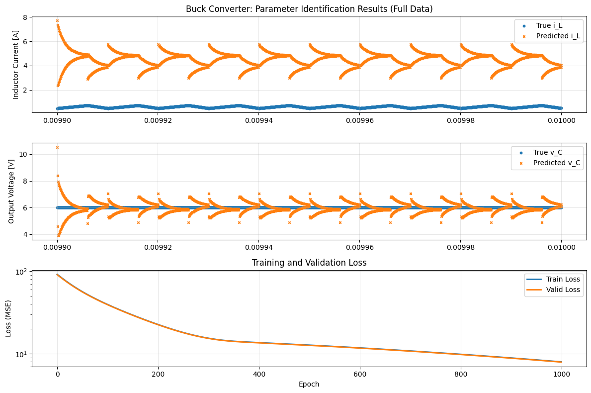

# 進捗報告 ?/?(?)

長崎大学工学部工学科 B4 丸田研究室\
35221011 大塚直哉

---

# これまで使っていたモデルが正しく理論通りのコードになっているか不明なため、Layer を明示的に実装して作り直す

## やったこと

### オイラー法

$$i_L(t + \Delta t) = i_L(t) + \frac{\Delta t}{L} (V_{in} * u(t) - v_c)$$

$$v_C(t + \Delta t) = v_C(t) + \frac{\Delta t}{C} \left( i_L - \frac{v_C}{R} \right)$$

### 線形 RNN で表す

BuckConverterRNNCell

$$
h_{t+1}
=
\underbrace{
\begin{bmatrix}
1 & -\frac{\Delta t}{L} \\
\frac{\Delta t}{C} & 1 - \frac{\Delta t}{CR}
\end{bmatrix}
}_{A}
h_t
+
\underbrace{
\begin{bmatrix}
\frac{\Delta t}{L} & 0 \\
0 & 0
\end{bmatrix}
}_{B}
\begin{bmatrix}
v_s(t) \\
u(t)
\end{bmatrix}
+
c
$$

$$v_s(t) = V_{in} * u(t)$$

$$
h_t =
\begin{bmatrix}
i_L(t) \\
v_C(t)
\end{bmatrix}
$$

BuckConverterRNNModel は、BuckConverterRNNCell を繰り返し適用して自己ループを再現する

```python
class BuckConverterRNNCell(nn.Module):
    def __init__(self) -> None:
        super().__init__()
        # A と B をパラメータとして学習
        self.A: nn.Parameter = nn.Parameter(torch.randn(2, 2))
        self.B: nn.Parameter = nn.Parameter(torch.randn(2, 2))
        self.c: nn.Parameter = nn.Parameter(torch.zeros(2))

    def forward(self, h: torch.Tensor, x: torch.Tensor) -> torch.Tensor:
        # h: [Batch, 2] = [iL, vC]
        # x: [Batch, 2] = [vs, u]
        return h @ self.A.T + x @ self.B.T + self.c


class BuckConverterRNNModel(nn.Module):
    def __init__(self) -> None:
        super().__init__()
        self.cell = BuckConverterRNNCell()

    def forward(self, h0: torch.Tensor, xs: torch.Tensor) -> torch.Tensor:
        """
        h0: [B, 2] 初期状態
        xs: [TimeStep, Batch, 2] 各時刻の入力 [vs, u]
        return: [TimeStep, Batch, 2]  各時刻の h_t
        """
        T, B, _ = xs.shape
        h = h0
        outputs = []
        for t in range(T):
            h = self.cell(h, xs[t])  # 自己ループ
            outputs.append(h)
        return torch.stack(outputs, dim=0)

```

## 学習に使った波形

```py
L_true: float = 100e-6
C_true: float = 48e-6
R_true: float = 10

Vin: float = 10
Vref: float = 6
f_sw: float = 1e5  # スイッチング周波数
points_per_cycle: int = 200  # 1周期あたりのプロット数
cycles: int = 1000  # 周期数
```

.png>)

後ろの 10 周期分だけ使う
.png>)

### 結果

割と大失敗した。。。

- 学習結果は、こんな感じ
  
- パラメータが全然外れまくってる

```bash
=== 学習済みモデルのパラメータ ===
A matrix:
tensor([[-1.0917,  0.1426],
        [-1.2775,  0.5258]])

B matrix:
tensor([[0.7840, 1.8773],
        [0.7824, 0.9847]])

c vector:
tensor([-0.4440,  0.1446])

=== True Parameters ===
True A matrix:
tensor([[ 1.0000e+00, -5.0000e-04],
        [ 1.0417e-03,  9.9990e-01]], dtype=torch.float64)

True B matrix:
tensor([[0.0005, 0.0000],
        [0.0000, 0.0000]], dtype=torch.float64)

True c vector:
tensor([0, 0])

```

- 前のモデルだったら、log で負の値をブロックすることで学習できたが、今回は初期値を基本的に 0〜1 のランダム(c は 0)にしていたし、重みを矯正するようなことはしていなかったからだと考える

- 学習時間も note14.ipynb で同じ学習データ、同じエポック数でやっても 0.2 秒、今回の note15.ipynb では 2 分以上かかってる 23 秒ほど
  - 前のモデルだと Time Step と Batch Size を同じにしてたからだと思う
  - そしたら一発の行列計算で終わるけど、今回は Batch Size を 1 にしてたから、Time Step 分の繰り返し処理をしちゃってるのか？

# NA

- 回路パラメータの 1 や 0 のような定数になっているところを固定して変化しないようにしてやってみる
- Batch Size を Time Step と同じにしてやってみる
